# Gene Studio

A plasmid workbench that runs in one file — circular and linear maps, an
annotated sequence view, restriction digests with a simulated agarose gel, PCR,
cloning, Golden Gate assembly, guide RNA design and Sanger `.ab1` review — by
**Jae-Yoon Sung**.

This repository holds **only the released builds and the version feed**. The
source is not here and is not public: Gene Studio is given to named people for
research, and copying, changing or redistributing it needs written permission.
The terms are in [`LICENSE`](LICENSE), and the same text ships inside the
application.

**[What Gene Studio is, with pictures →](https://jaeyoonsung.github.io/GeneStudio-releases/)**
&nbsp;·&nbsp; **[Download the latest build →](../../releases/latest)**

The application opens on a licence window showing a **Machine ID**. Send it to
**genestudio.help@gmail.com** and paste back the licence you are given; it runs
on that computer and nowhere else. The window composes that mail for you — fill
in your name and institution and it fills in the rest.

*macOS*: open the .dmg and drag Gene Studio to Applications. It is signed with a
Developer ID and notarized by Apple, so it opens on a double-click.
*Windows*: run the setup .exe; if SmartScreen appears, choose **More info → Run
anyway**.

Every picture below is the demonstration construct that ships with the app.

---

### The map

Double-stranded, both topologies, features packed per strand — top-strand
outside the pair and bottom-strand inside. A name that fits its arc is written
on the arc; the rest go to a margin column whose leaders fade where they cross
the loci. Enzyme sites are ticks through the backbone, and hovering a name
lights every cut that enzyme makes.

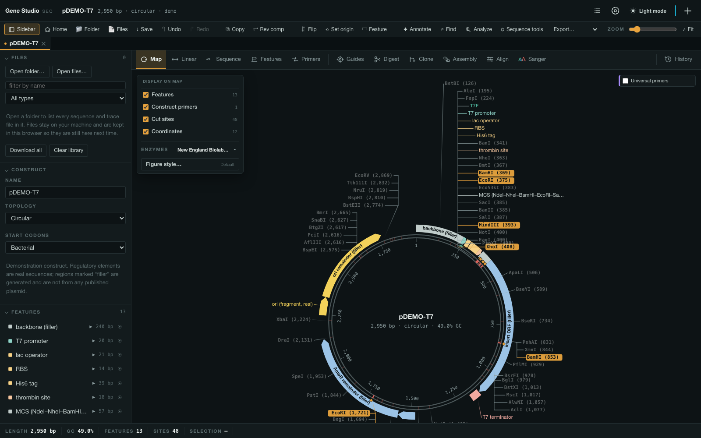

### The sequence

Loci and their cut marks above the line, forward primers next, then both
strands, then each translation drawn **under the residues it belongs to**, and
reverse primers below the strand they run backwards along. A restriction cut is
a stepped `ㄴㄱ` through both strands, so which strand breaks where — and which
way the overhang points — is read off the bases rather than inferred from the
enzyme's name.

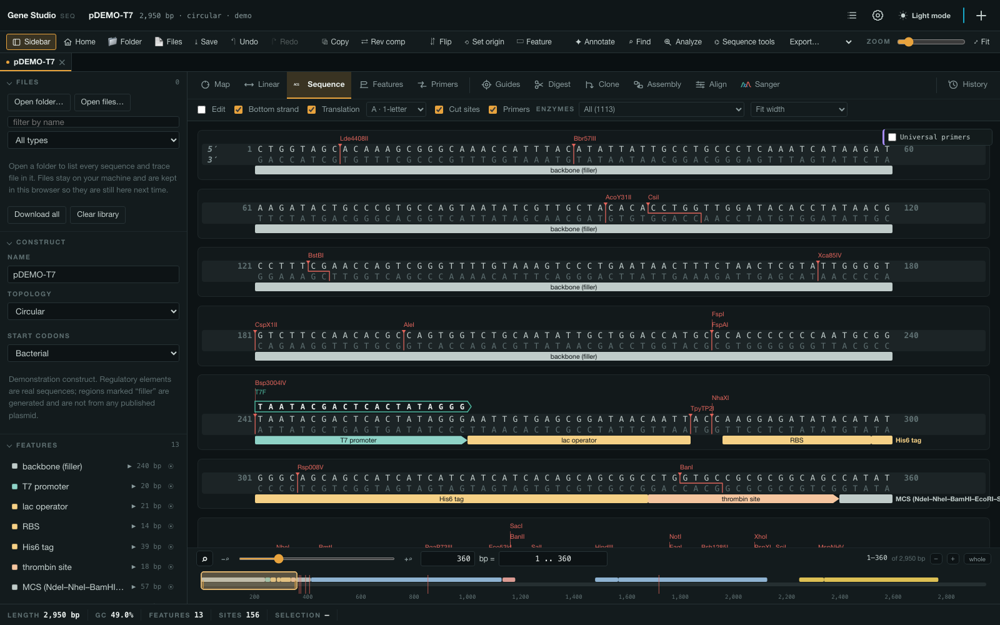

### The linear map

The same molecule unrolled, with its own layer switches: what has to go to make
a ring legible is not what has to go for a row.

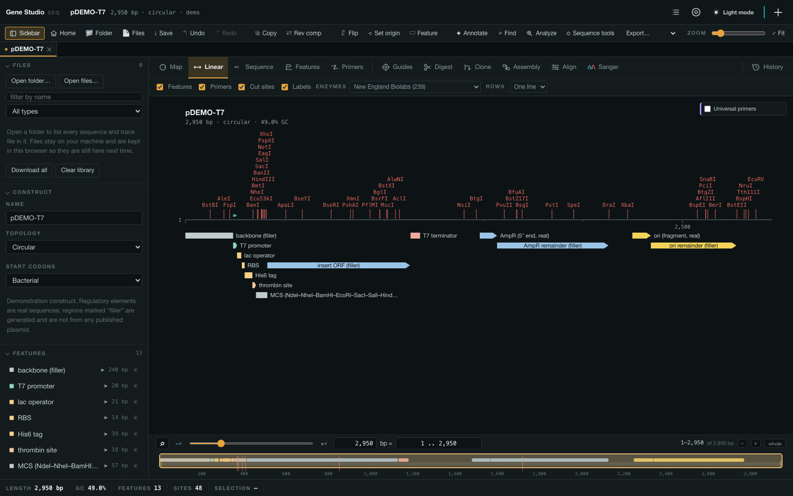

### Digests, on a gel

A real gel's shape: even lanes on a dark slab, the ladder in lane 1, the uncut
control in lane 2. A band's size is on hover, the way a gel is read against its
ladder. Blocked cuts are named under the gel — methylation is checked against
the strain the DNA was grown in, not assumed.

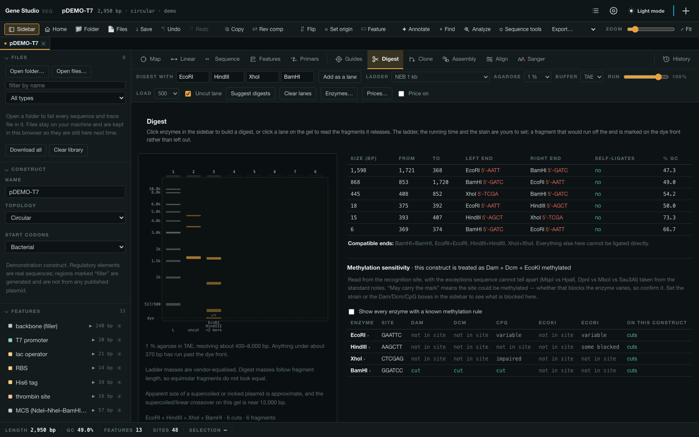

### The feature table

Every field the record carries, a column per qualifier, ordered the way GenBank
writes them — so nothing in the file is quietly dropped by a table with a fixed
set of columns. *Full + computed* adds what is in no GenBank: %GC, mass, pI,
GRAVY and the ribosome binding site with its spacer and score.

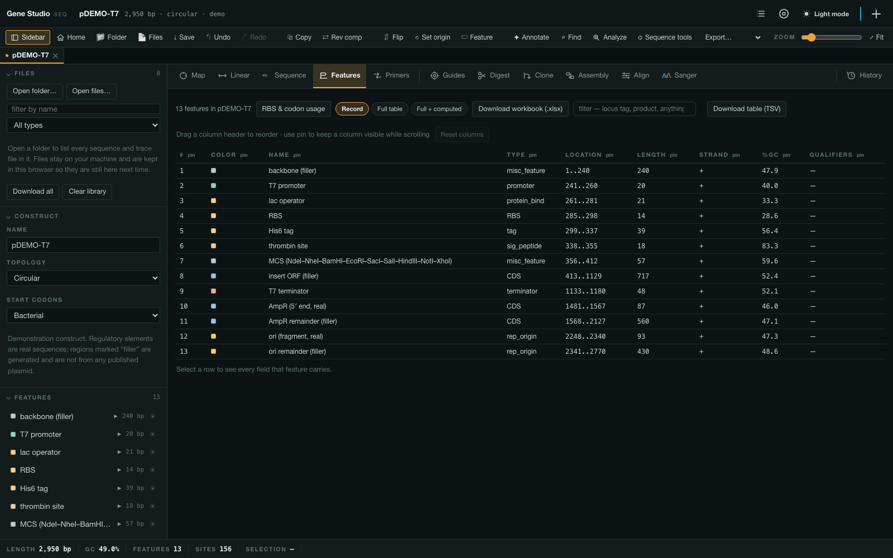

### Primers and PCR

The construct's own primers, the lab's freezer stock and the universal set are
three layers with three switches. A primer is matched by its **3′ end**, since
that is the end a polymerase extends from — a 5′ overhang matches nothing and is
measured rather than required, and a designed mismatch inside the annealing is
the point of a mutagenic primer rather than a failure to bind.

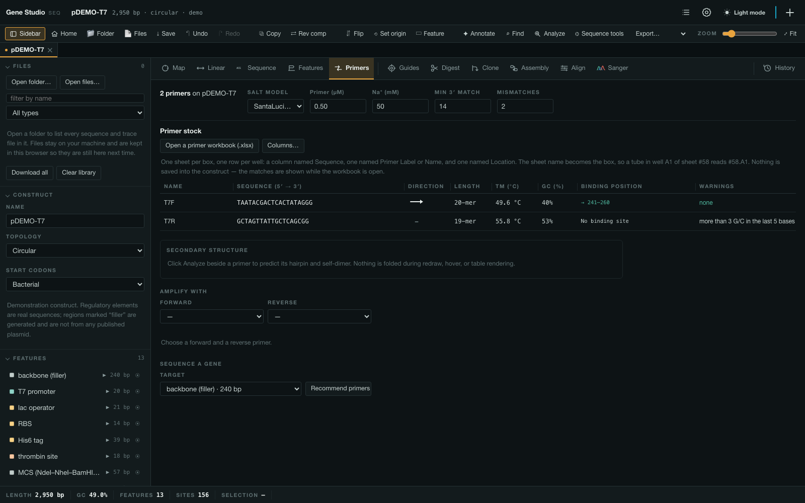

### Guide RNAs and deletion arms

Ported from the author's own PrimerDesigner: guide scoring, Golden Gate oligos,
Gibson inverse-PCR primers and four-primer deletion arms, with the nuclease
table and thresholds copied rather than reinvented.

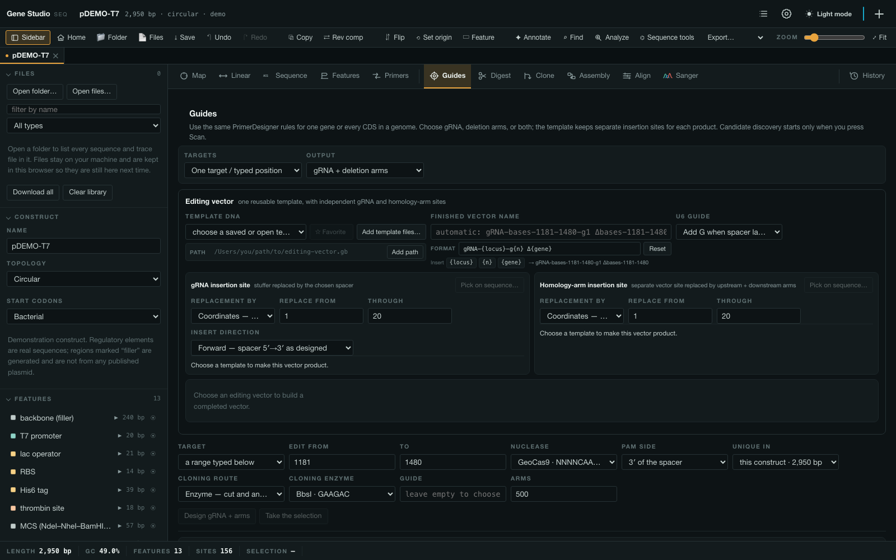

### Cloning

A region of one construct into another: two parents, a region picked on each by
pointing at it, the primers that do the job and the construct that comes out —
side by side, recomputed on every change.

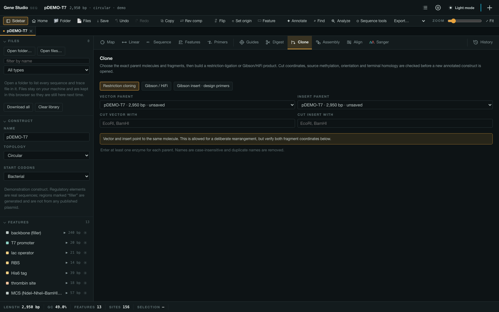

### Golden Gate assembly

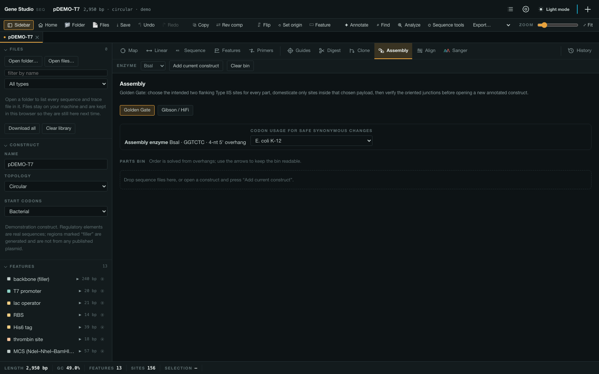

### Sanger reads

A pileup in the construct's own coordinates, each read's chromatogram drawn in
the same columns directly beneath its bases. A read with an indel is aligned
with a gap rather than reported as a wall of mismatches, and a difference is
judged on the neighbourhood's quality — the end of a Sanger read decays, and a
dozen disagreements in a row there is not a dozen variants.

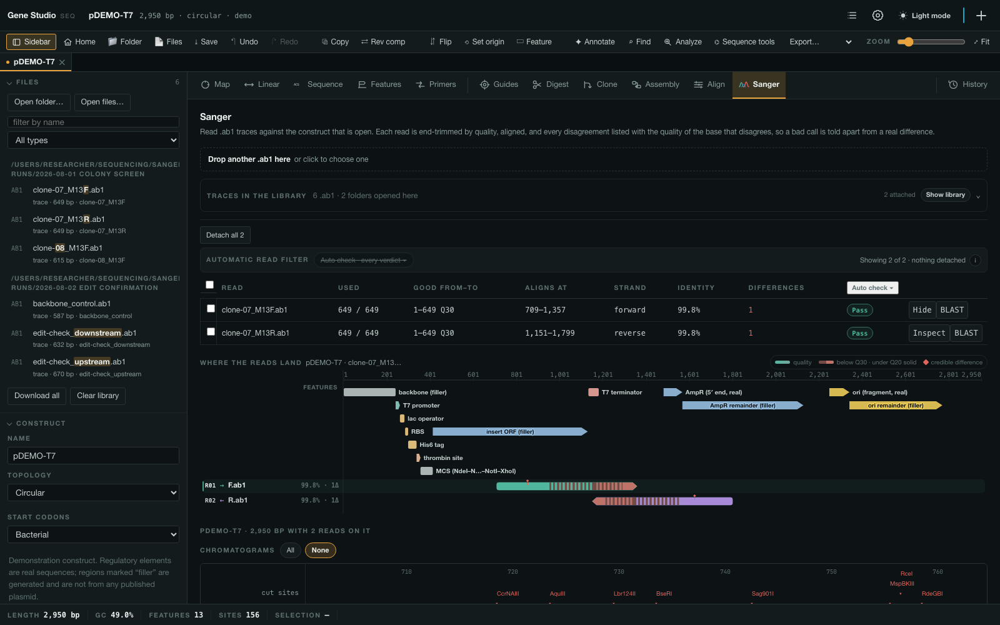

### Figures

Every drawing is SVG — paths and text, not pixels — and exports as vector with
the stylesheet resolved, editable in Illustrator.

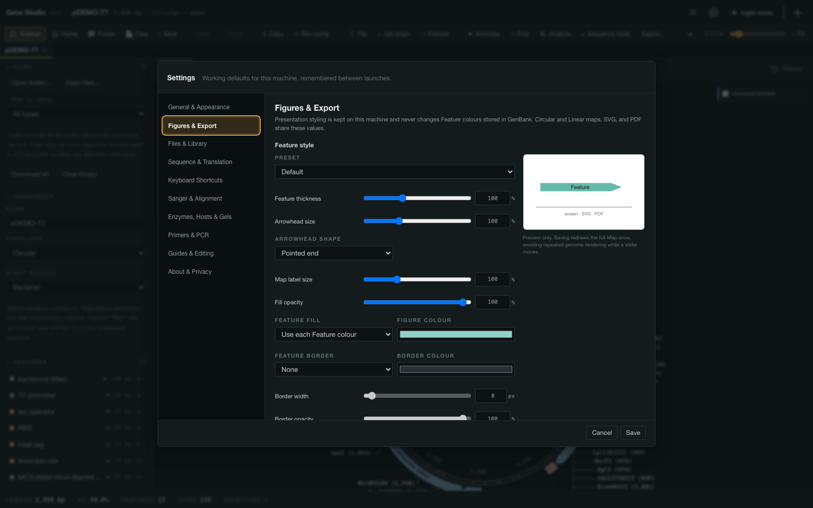

---

## Licence

**Copyright © 2026 Jae-Yoon Sung. All rights reserved.**

Gene Studio is **not open source**. The builds published here are covered by the
[Gene Studio Research Use Licence](LICENSE) — the same terms that ship inside the
application. In short:

- Install and run it on the computer your licence key names, for research,
  teaching and study, including work you publish. Your data, your constructs and
  your findings stay yours.
- **Do not modify it, and do not build anything out of it.** That covers a
  modified build, a repackaged installer, and any other program containing part
  of this one. Taking it apart to obtain the source — decompiling,
  disassembling, unpacking the bundle — is not permitted either, nor is removing
  or altering the licence check, the copyright notices or the attributions.
- Do not pass on the installer, the application or a licence key; do not sell,
  rent or host it as a service, or put it inside a commercial product.
- For research use, ask: the answer is usually yes. Written permission means an
  email from the author saying so — **genestudio.help@gmail.com**.

Authorship and every right in Gene Studio remain with Jae-Yoon Sung. Nothing in
this repository is offered under an open-source licence, and no permission
beyond `LICENSE` is granted by the builds being publicly downloadable. The
third-party components listed below keep their own terms and are not restricted
by it.

---

The restriction-enzyme data is **REBASE**'s (Roberts, Vincze, Posfai & Macelis,
*Nucleic Acids Research*, rebase.neb.com) and should be cited as theirs. MAFFT,
SeqFold and Aioli run locally under their own licences; full notices ship with
the application. The `.dna` reader was worked out from the bytes of real files
for interoperability — Gene Studio contains no SnapGene code and is not
connected with, or endorsed by, SnapGene or Dotmatics.
