# Gene Studio

A plasmid workbench that runs in one file — circular and linear maps, an
annotated sequence view, restriction digests with a simulated agarose gel, PCR,
cloning, Golden Gate assembly, guide RNA design and Sanger `.ab1` review — by
**Jae-Yoon Sung**.

This repository holds **only the released builds and the version feed**. The
source is not here and is not public: Gene Studio is given to named people for
research, and copying, changing or redistributing it needs written permission.
The terms are in [`LICENSE`](LICENSE), and the same text ships inside the
application.

**[What Gene Studio is, with pictures →](https://genestudio.app/)**
&nbsp;·&nbsp; **[Download the latest build →](../../releases/latest)**

The application opens on a licence window showing a **Machine ID**. Send it to
**genestudio.help@gmail.com** and paste back the licence you are given; it runs
on that computer and nowhere else. The window composes that mail for you — fill
in your name and institution and it fills in the rest.

*macOS*: open the .dmg and drag Gene Studio to Applications. It is signed with a
Developer ID and notarized by Apple, so it opens on a double-click.
*Windows*: run the setup .exe; if SmartScreen appears, choose **More info → Run
anyway**.

Every picture below is the demonstration construct that ships with the app.

---

### The map

Double-stranded, both topologies, features packed per strand — top-strand
outside the pair and bottom-strand inside. A name that fits its arc is written
on the arc; the rest go to a margin column whose leaders fade where they cross
the loci. Enzyme sites are ticks through the backbone, and hovering a name
lights every cut that enzyme makes.

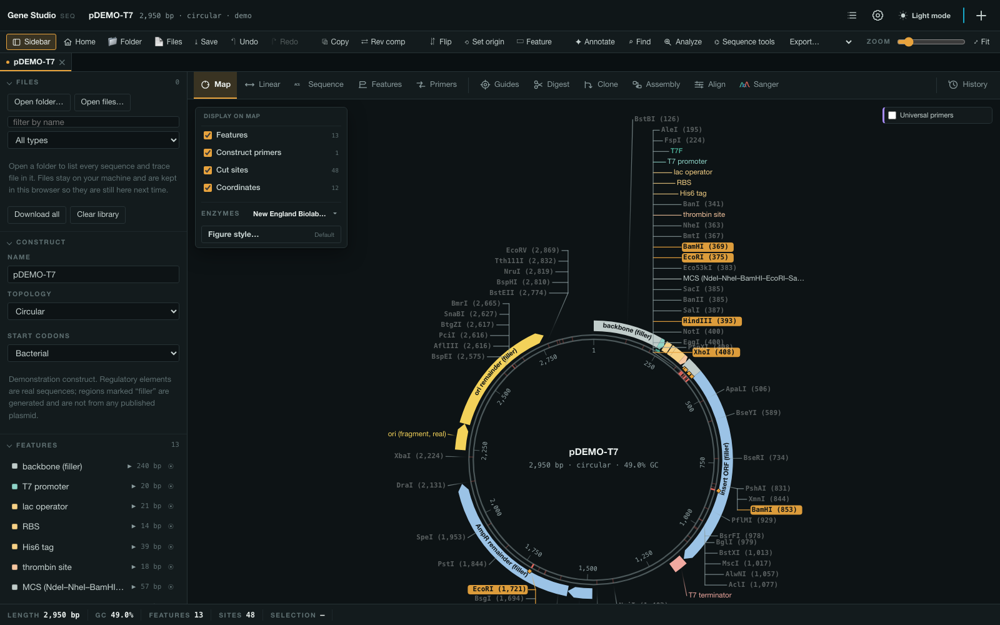

### The sequence

Loci and their cut marks above the line, forward primers next, then both
strands, then each translation drawn **under the residues it belongs to**, and
reverse primers below the strand they run backwards along. A restriction cut is
a stepped `ㄴㄱ` through both strands, so which strand breaks where — and which
way the overhang points — is read off the bases rather than inferred from the
enzyme's name.

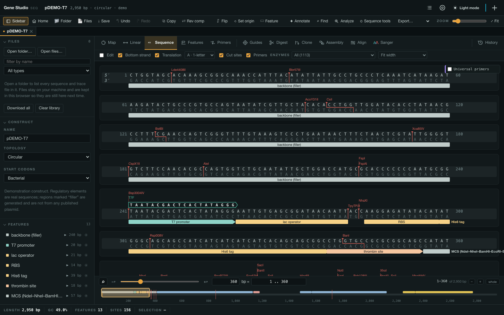

### The linear map

The same molecule unrolled, with its own layer switches: what has to go to make
a ring legible is not what has to go for a row.

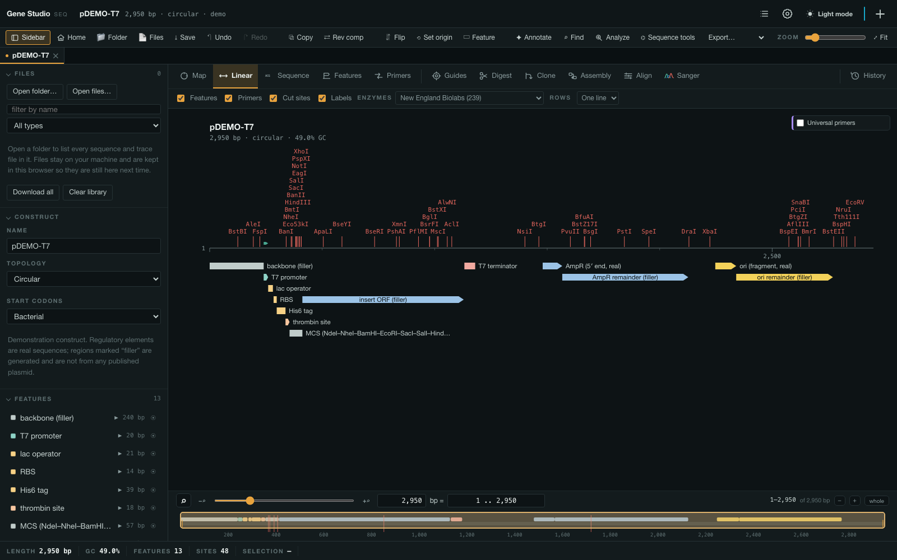

### Digests, on a gel

A real gel's shape: even lanes on a dark slab, the ladder in lane 1, the uncut
control in lane 2. A band's size is on hover, the way a gel is read against its
ladder. Blocked cuts are named under the gel — methylation is checked against
the strain the DNA was grown in, not assumed.

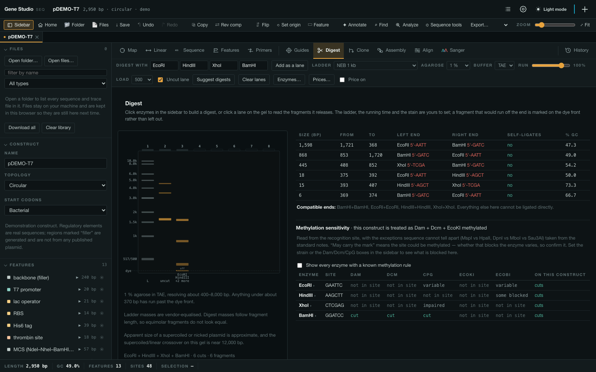

### The feature table

Every field the record carries, a column per qualifier, ordered the way GenBank
writes them — so nothing in the file is quietly dropped by a table with a fixed
set of columns. *Full + computed* adds what is in no GenBank: %GC, mass, pI,
GRAVY and the ribosome binding site with its spacer and score.

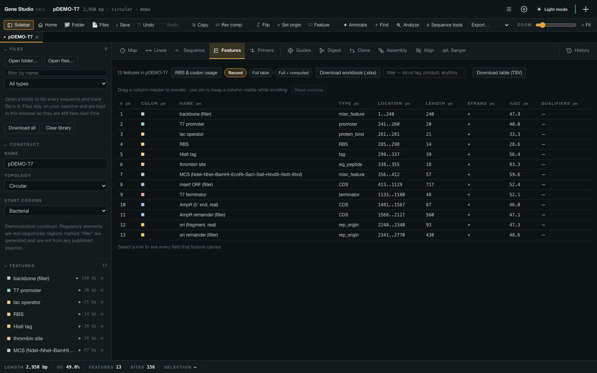

### Primers and PCR

The construct's own primers, the lab's freezer stock and the universal set are
three layers with three switches. A primer is matched by its **3′ end**, since
that is the end a polymerase extends from — a 5′ overhang matches nothing and is
measured rather than required, and a designed mismatch inside the annealing is
the point of a mutagenic primer rather than a failure to bind.

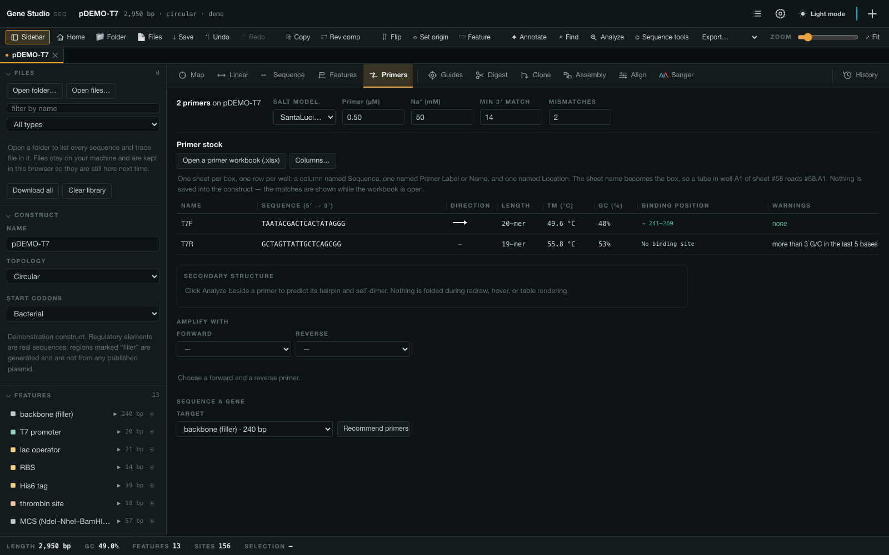

### Guide RNAs and deletion arms

Ported from the author's own PrimerDesigner: guide scoring, Golden Gate oligos,
Gibson inverse-PCR primers and four-primer deletion arms, with the nuclease
table and thresholds copied rather than reinvented.

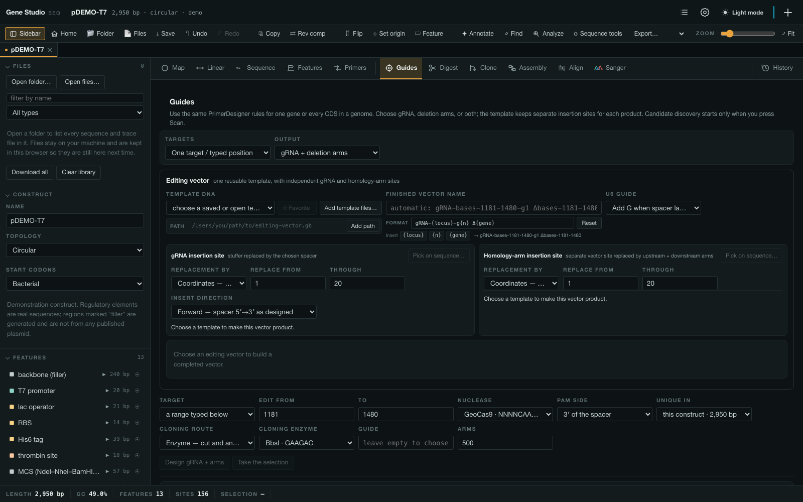

### Cloning

A region of one construct into another: two parents, a region picked on each by
pointing at it, the primers that do the job and the construct that comes out —
side by side, recomputed on every change.

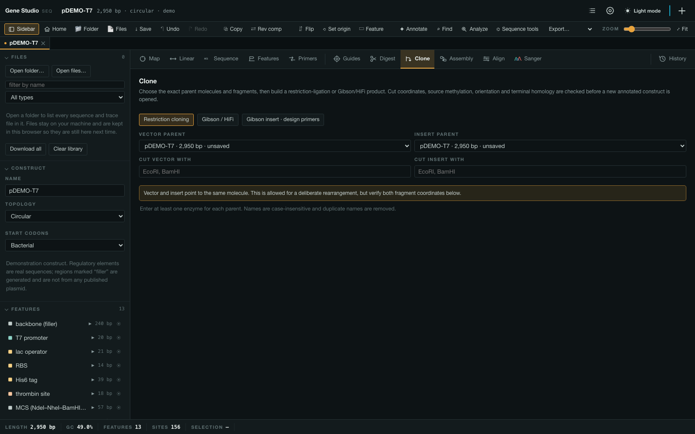

### Golden Gate assembly

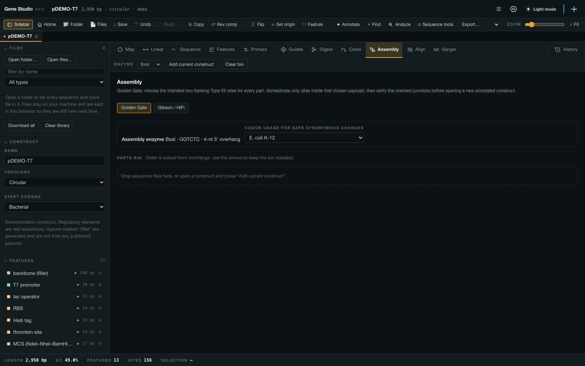

### Sanger reads

A pileup in the construct's own coordinates, each read's chromatogram drawn in
the same columns directly beneath its bases. A read with an indel is aligned
with a gap rather than reported as a wall of mismatches, and a difference is
judged on the neighbourhood's quality — the end of a Sanger read decays, and a
dozen disagreements in a row there is not a dozen variants.

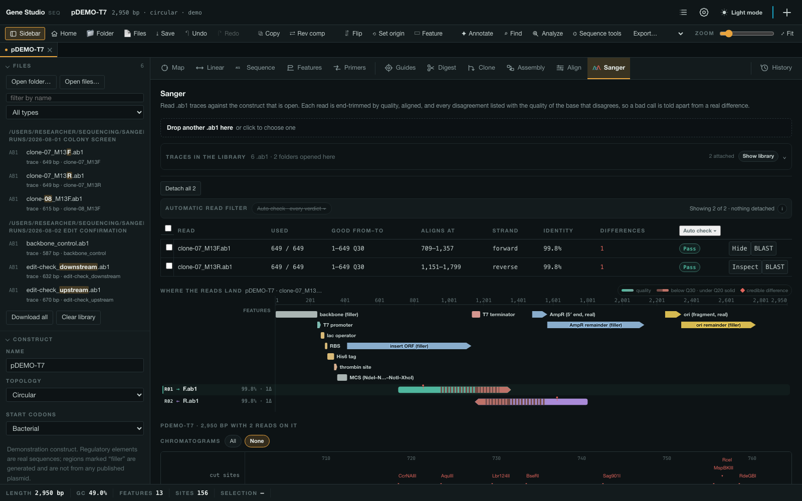

### Figures

Every drawing is SVG — paths and text, not pixels — and exports as vector with
the stylesheet resolved, editable in Illustrator.

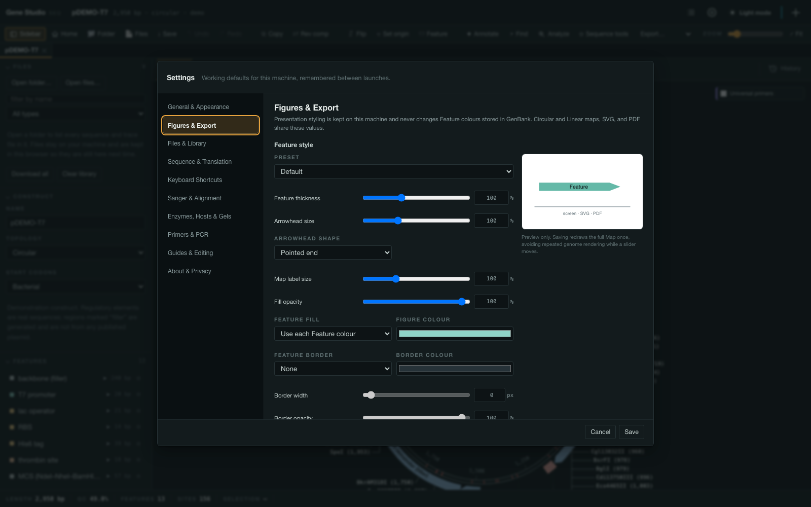

---

## Licence

**Copyright © 2026 Jae-Yoon Sung. All rights reserved.**

Gene Studio is **not open source**. The builds published here are covered by the
[Gene Studio Research Use Licence](LICENSE) — the same terms that ship inside the
application. In short:

- Install and run it on the computer your licence key names, for research,
  teaching and study, including work you publish. Your data, your constructs and
  your findings stay yours.
- **Do not modify it, and do not build anything out of it.** That covers a
  modified build, a repackaged installer, and any other program containing part
  of this one. Taking it apart to obtain the source — decompiling,
  disassembling, unpacking the bundle — is not permitted either, nor is removing
  or altering the licence check, the copyright notices or the attributions.
- Do not pass on the installer, the application or a licence key; do not sell,
  rent or host it as a service, or put it inside a commercial product.
- For research use, ask: the answer is usually yes. Written permission means an
  email from the author saying so — **genestudio.help@gmail.com**.

Authorship and every right in Gene Studio remain with Jae-Yoon Sung. Nothing in
this repository is offered under an open-source licence, and no permission
beyond `LICENSE` is granted by the builds being publicly downloadable. The
third-party components listed below keep their own terms and are not restricted
by it.

---

The restriction-enzyme data is **REBASE**'s (Roberts, Vincze, Posfai & Macelis,
*Nucleic Acids Research*, rebase.neb.com) and should be cited as theirs. MAFFT,
SeqFold and Aioli run locally under their own licences; full notices ship with
the application. The `.dna` reader was worked out from the bytes of real files
for interoperability — Gene Studio contains no SnapGene code and is not
connected with, or endorsed by, SnapGene or Dotmatics.

<!-- gene-studio:release-notes:begin -->
## Release notes

Version-specific changes are retained below. Earlier releases: [GitHub Releases](https://github.com/JAEYOONSUNG/GeneStudio-releases/releases).

<!-- gene-studio:release:1.4.27:begin published-at=2026-10-06T15:18:28.000Z -->
### [1.4.27](https://github.com/JAEYOONSUNG/GeneStudio-releases/releases/tag/v1.4.27) — 2026-10-06

- Strain DB’s Choose folder now recognizes DNMB runs and reads their root GenBank file, including chromosome and plasmid records. Module copies and cached genomes are excluded, and matching saved profiles receive a reviewed refresh instead of a duplicate.
- Imported REBASEfinder matches show recorded identities, references and source rows while preserving curated R–M systems and activity calls. A completed zero-hit result clears earlier imported matches; evidence that exceeds the profile limit is refused without discarding saved data.
- DNMB report lookup accepts a strain folder or its parent library, requires the exact assembly version and reports ambiguous matches instead of choosing a run silently.
- The built-in Geobacillus thermoleovorans KCTC 3570 profile includes 17 original DNMB reference PDFs. User-connected reports take priority, and damaged saved reports are not silently replaced with bundled references.
- The Korean website now shares the English homepage’s current content and layout. A visible header button switches languages on desktop and phones, and menu hover colors match their icons in both themes.
<!-- gene-studio:release:1.4.27:end -->

<!-- gene-studio:release:1.4.26:begin published-at=2026-10-06T10:59:24.000Z -->
### [1.4.26](https://github.com/JAEYOONSUNG/GeneStudio-releases/releases/tag/v1.4.26) — 2026-10-06

- Sequence search starts within the selected region, or at the visible reading position, and keeps every match available through Next and Previous. Typing previews results without moving the view.
- Primers keep their lanes across wrapped Sequence rows. Guides disable the cloning-enzyme control for Inverse PCR and show the saved target's surrounding sequence and PAM alongside the vector preview, including when methylation data is unavailable.
- Large template sequence pickers use bounded windows. Leaving a view clears its native text selection, and an interrupted desktop renderer offers an explicit recovery action instead of leaving an unusable blank workspace.
- Strain profiles can import existing DNMBsuite result folders without rerunning the analyses. Saved tables and original reports remain accessible with their source records. REBASE discovery recognizes public species synonyms and keeps reference evidence separate from curated activity calls.
<!-- gene-studio:release:1.4.26:end -->

<!-- gene-studio:release:1.4.25:begin published-at=2026-10-06T05:24:03.000Z -->
### [1.4.25](https://github.com/JAEYOONSUNG/GeneStudio-releases/releases/tag/v1.4.25) — 2026-10-06

- Home now lets you star individual files, including DNA vectors, and collect them in Favorite files in both Cards and Details views. Stars stay on this device without changing the sequence file.
- Recent files includes the full recorded opening history instead of stopping at ten files. Older entries remain searchable and can be shown in additional batches; folder scans no longer count as file opens.
- Successful Sanger file opens, first saves and reopened Save As copies now appear in Home. Failed file opens do not create new history entries.
- Folder refreshes and file renames preserve recent history and the latest star or unstar decision, including changes made while a scan is running. Restored native tabs can recover missing history entries.
- Saving a star no longer interrupts a search edit made while that save is finishing.
- The Guides Target picker now accepts typed feature names and locus tags, including targets beyond the old first-300 list. Search keeps the manual range option and keyboard selection.
- A selected CDS can open Guide design directly from the Features table or the Sequence/Map context menu, carrying its exact target and range. Circular targets display their wrapped length correctly.
- Click a populated value in the bottom information bar to copy it, or use Enter/Space while focused. Peptide copies its full sequence even when the displayed value is shortened; unavailable values stay inactive.
<!-- gene-studio:release:1.4.25:end -->

<!-- gene-studio:release:1.4.24:begin published-at=2026-10-05T21:57:19.000Z -->
### [1.4.24](https://github.com/JAEYOONSUNG/GeneStudio-releases/releases/tag/v1.4.24) — 2026-10-05

- Home library search now keeps the caret, selection, native Undo/Redo and text composition in place while editing the middle of a query or refreshing folders.
- Background Home refreshes no longer commit unfinished file-name or hidden-extension drafts. An unfinished rename cannot restore a file that has been removed from the library.
- Result-table filters, motif fields, query-region drafts and Alignment editors retain their input during workflow updates. Figure controls finish their current edit before a pending refresh, without swallowing button clicks.
- Feature coordinates remain editable drafts while typing and are formatted when committed. Clearing or entering an incomplete coordinate no longer silently moves a feature.
- IME confirmation and cancellation keys stay with the native editor instead of submitting searches or closing dialogs.
- Primer sequence editing preserves native Undo/Redo, selection and composition across focus changes. Apply still validates and normalizes saved sequences; per-line coordinates are omitted when the literal draft is not correctly grouped.
<!-- gene-studio:release:1.4.24:end -->

<!-- gene-studio:release:1.4.23:begin published-at=2026-10-05T09:28:04.000Z -->
### [1.4.23](https://github.com/JAEYOONSUNG/GeneStudio-releases/releases/tag/v1.4.23) — 2026-10-05

- Map display checkboxes now use neutral theme colours instead of a green tint. Checkmarks, partial selections and keyboard focus remain clear in light and dark themes.
<!-- gene-studio:release:1.4.23:end -->

<!-- gene-studio:release:1.4.22:begin published-at=2026-10-05T08:13:07.000Z -->
### [1.4.22](https://github.com/JAEYOONSUNG/GeneStudio-releases/releases/tag/v1.4.22) — 2026-10-05

- Fixed copying HEX values from the macOS colour picker using Cmd+C or Edit > Copy.
- Copy now respects selected text in dialogs, read-only fields and auxiliary windows. Selecting bases, amino acids or Sanger read regions also clears stale field focus and text selections that could intercept copying.
- Copying a sequence region within the same Gene Studio session now carries attached freezer and universal primers, including their names, complete sequences, notes and colours, without duplicating repeated bindings.
- New primers created from a selection now open as drafts. Escape or Cancel closes an unchanged draft without adding a primer or an undo entry.
- Clipboard fallback preserves focus and text selection, reports copy failures accurately and prevents an older failed copy from overwriting a newer copy.
- Map options use softly raised controls and a mint selected tint in light and dark themes, with clear selected, partial and keyboard-focus states for Marks, Labels and All labels.
<!-- gene-studio:release:1.4.22:end -->

<!-- gene-studio:release:1.4.21:begin published-at=2026-10-04T11:01:19.000Z -->
### [1.4.21](https://github.com/JAEYOONSUNG/GeneStudio-releases/releases/tag/v1.4.21) — 2026-10-04

- Home workspace cards now reveal translucent liquid colour and refracted highlights from the pointer entry edge. The effect is more visible while titles, icons and construct details stay sharp and stationary.
- Card motion uses one shared renderer and settles after the transition. Reduced-motion, touch and graphics fallback modes keep static feedback, and leaving Home releases the effect resources.
- Map Marks, Labels and All labels checkboxes now use compact outlined controls with a light selected tint and crisp centred ticks. Full row hit areas, keyboard focus and partial-selection states are preserved.
<!-- gene-studio:release:1.4.21:end -->

<!-- gene-studio:release:1.4.20:begin published-at=2026-10-03T15:39:54.000Z -->
### [1.4.20](https://github.com/JAEYOONSUNG/GeneStudio-releases/releases/tag/v1.4.20) — 2026-10-03

- Map Marks and Labels controls now use smaller, centred filled checkmarks with clear off and mixed states. Keyboard focus follows the individual control while the full row-cell click area stays available.
- Home workspace cards use soft glass reflections in place of the expanding wave fill. Text stays still and readable, the current workspace has a cleaner selection treatment, and motion settles quickly with static feedback for reduced-motion and touch input.
<!-- gene-studio:release:1.4.20:end -->

<!-- gene-studio:release:1.4.19:begin published-at=2026-10-03T05:46:54.000Z -->
### [1.4.19](https://github.com/JAEYOONSUNG/GeneStudio-releases/releases/tag/v1.4.19) — 2026-10-03

- Map centre labels can now use a separate multiline display title while keeping the construct and file names intact. Choose title, length, topology and GC information directly in the label editor; long labels wrap or move below a small map, and saved documents and figure exports preserve the complete text.
- Gel tracking dyes have softer, diffuse fronts clipped to the gel interior, so BPB and other dyes stay inside the frame while DNA bands and migration positions remain unchanged.
- macOS gains dedicated high-resolution document icons for FASTA, GenBank, DNA, Sanger traces, ApE and plain sequence files, with distinct artwork for small Finder sizes and Retina displays.
<!-- gene-studio:release:1.4.19:end -->

<!-- gene-studio:release:1.4.18:begin published-at=2026-10-03T03:15:24.000Z -->
### [1.4.18](https://github.com/JAEYOONSUNG/GeneStudio-releases/releases/tag/v1.4.18) — 2026-10-03

- Map options now presents Marks and Labels in a compact, clearer layer panel with aligned density, feature and label controls. Curved and Straight label-line choices use a smooth sliding selection that follows rapid changes, preserves keyboard focus and respects reduced motion.
- Search comparisons in Sequence now use bold query letters, including inserted bases, so they stand out above the reference without changing native sequence spacing or coordinates. Substitutions receive stronger paired highlights on both the query and reference.
- Home workspace cards gain a subtle directional liquid-color hover effect while keeping labels sharp, active workspace indicators clear and navigation immediate; reduced-motion preferences are respected.
<!-- gene-studio:release:1.4.18:end -->

<!-- gene-studio:release:1.4.17:begin published-at=2026-10-02T23:33:14.000Z -->
### [1.4.17](https://github.com/JAEYOONSUNG/GeneStudio-releases/releases/tag/v1.4.17) — 2026-10-02

- DNA searches with no exact match now offer Find similar in a visible confirmation after typing settles or the search is confirmed. Accepting searches the whole construct for substitutions, insertions and deletions, then opens the current query's inline comparison immediately. Cancel keeps the exact-search result; changed queries or documents invalidate old prompts, and confirmation is guarded against duplicate activation.
- Inserted query bases now sit on a connected green sequence rail with their insertion position and full sequence visible. Deletions use stronger purple backgrounds and closed outlines on both the query gaps and corresponding reference bases, while native sequence coordinates and spacing stay unchanged.
<!-- gene-studio:release:1.4.17:end -->

<!-- gene-studio:release:1.4.16:begin published-at=2026-10-02T18:07:28.000Z -->
### [1.4.16](https://github.com/JAEYOONSUNG/GeneStudio-releases/releases/tag/v1.4.16) — 2026-10-02

- Find similar now aligns through internal insertions and deletions and continues comparing the downstream sequence. Results report query coverage, substitutions and inserted or deleted bases on either strand, including circular-origin spans; uncovered query regions and uncertain repeat placement remain explicit.
- Sequence comparisons have a clearer outlined, tinted query band and Query/Reference coordinate labels. Inserted bases appear in full beside a pin at their exact between-base position, deleted query bases appear as dashes against the reference, and substitutions retain paired gold boxes. The original sequence grid, annotations and editing coordinates are preserved.
<!-- gene-studio:release:1.4.16:end -->

<!-- gene-studio:release:1.4.15:begin published-at=2026-10-02T13:45:27.000Z -->
### [1.4.15](https://github.com/JAEYOONSUNG/GeneStudio-releases/releases/tag/v1.4.15) — 2026-10-02

- Find similar: differing query and reference bases now have clear gold boxes and tinted backgrounds, distinct from red restriction-site marks. Adjacent differences share a joined frame while matching bases remain plain.
- Sequence translation: selected amino acids retain their feature colour instead of receiving an opaque interface-accent band. A light wash and underline mark selected coding residues; selected run-on residues remain readable and use a dashed line to distinguish them from the annotated gene.
- Circular Map: clustered cut marks use lighter fills and slimmer outlines and endpoint rails, reducing the heavy-bar appearance while retaining cluster members, true cut positions, hover details and export information.
<!-- gene-studio:release:1.4.15:end -->

<!-- gene-studio:release:1.4.14:begin published-at=2026-10-02T08:42:21.000Z -->
### [1.4.14](https://github.com/JAEYOONSUNG/GeneStudio-releases/releases/tag/v1.4.14) — 2026-10-02

- Sequence Find similar: query bases now sit directly beside the corresponding reference strand, with primer and annotation tracks outside the comparison. Differing bases receive stronger paired highlights on both the query and reference; original sequence, letter case, coordinates and annotations remain unchanged.
- Map options: consistent checkbox sizes and checkmarks, aligned label and control columns, and matching heights and corner radii for selectors, buttons and segmented controls. All labels aligns with the Labels column, and narrow screens retain 44 px control targets.
- Open DNA files: flatter tabs with a lighter selected surface and one clear underline replace the outlined pill style. Close icons are centred in consistent targets; minimum tab widths, scrolling, immediate full names and drag reordering are preserved.
<!-- gene-studio:release:1.4.14:end -->

<!-- gene-studio:release:1.4.13:begin published-at=2026-10-02T06:17:35.000Z -->
### [1.4.13](https://github.com/JAEYOONSUNG/GeneStudio-releases/releases/tag/v1.4.13) — 2026-10-02

- Strain DB: clearer section headings and spacing for profile identity, revision review, source records, RBS evidence and R–M details. Genome inspection and annotation curation actions are grouped separately, with readable layouts on narrower screens.
- Align: visible starting options for a sequence search or saved results, links back to source results, and direct access to retained alignments and trees. Searches use the chosen provider and still require explicit submission; local alignment work and existing input are preserved.
- Find similar: compare the selected DNA query directly with the reference in Sequence. Substitutions receive an underline and a quiet highlight; matching letters remain plain. Reverse-complement and circular-origin matches retain their query and reference coordinates, and prefix-only matches explicitly identify the uncovered query suffix.
- Sequence: one readable comparison summary replaces repeated long row headings. Measured coordinate gutters keep complete numbers and strand labels visible; fixed-width rows remain scrollable when needed. Query captions stay visible while panning, and primer continuation names remain inside their displayed row. Light-mode primer-name strokes match the Sequence background, while dark-mode halos retain their contrast.
- Find now reserves its own footer space, keeping the Sequence reader, navigator and readout above the search controls.
- Linear: the Sources controls now share consistent height and padding with neighbouring toolbar groups.
- Navigation: stronger active-file and active-view emphasis, with clearer neutral interface borders. Open DNA file tabs retain a readable minimum width and scroll horizontally; full names appear immediately on hover, and newly selected or opened files are brought into view. The sequence typeface, case masks and biological colours are preserved.
- Home: compact cards with quiet translucent surfaces and consistent workflow icons.
- Primers table: small triangles below the 10th, 20th and subsequent ten-base positions in the 5′→3′ Sequence column make oligos easier to count, without inserting spaces or changing copied or exported sequences. Reverse primers are counted in their own displayed 5′→3′ direction.
- Map controls: layer and label switches use consistent checked and unchecked indicators. The All labels switch has centred check and mixed-state marks, with clearer hover and keyboard-focus feedback.
- macOS installer: a branded Retina background and clear drag-to-Applications layout, with both native icons and their names visible inside the compact Finder window.
<!-- gene-studio:release:1.4.13:end -->

<!-- gene-studio:release:1.4.12:begin published-at=2026-10-01T09:31:10.000Z -->
### [1.4.12](https://github.com/JAEYOONSUNG/GeneStudio-releases/releases/tag/v1.4.12) — 2026-10-01

- Align: the result is drawn the way ggmsa draws one — residues on the published colour schemes (Clustal X, Zappo, Taylor, Chemistry, Hydrophobicity, Nucleotide), a sequence logo in bits, a conservation bar and the consensus above the rows, names fixed at the left. It draws only what is on screen, so a large family scrolls freely instead of being paged, and it can show letters on colour, colour alone, or only the differences from the reference.
- Align: "One line · scroll" or "Wrap to width", which folds the alignment into blocks as wide as the window; the zoom runs from an overview of a whole family to readable letters, and hovering a residue says its column, its own position and how conserved the column is.
- Align: Figure SVG and Figure JPG export the alignment exactly as it is drawn — the same colours, tracks and layout — as a publication figure.
- Align: one step from sequences to a tree. A card above the steps holds every setting — engine, preset, trim rule, tree method, figure colours — and Run all steps aligns, trims, builds the tree and draws the figure in one go, saying how each step ended.
- Primers: the Detail column shows its two buttons whole, whatever width had been saved for the old Structure column.
- Align: the alignment is read one residue at a time, the way a Sanger read is checked. Click a residue to hold its column — every sequence's residue there, its own position in that sequence, and whether it is the same as the reference, a conservative change, a gap or an insertion, with the column's consensus, conservation and gaps — shift-click for a range (copied out as FASTA), click a name for that sequence's summary and ungapped sequence, and walk with the arrow keys. Every tile is the same box with the same one-pixel gutter at any zoom.
- Align: a held column shows what it is made of — a stacked bar of its residues in the scheme's colours, each count and share, the gaps, and the column's entropy in bits. **Pairwise identity** opens an n × n heatmap of every pair's identity over the columns both cover; hover reads a pair, a click holds that sequence, and the matrix copies out as TSV.
- Align: the sequence logo draws each letter fitted to exactly the height its bits earn, in the glyph's own measured shape, so stacked letters touch without overlapping and a narrow letter such as I stays a letter rather than a block; a residue too short to read is a faint block. The exported figure draws the same logo.
- Align: the engine note says each thing once.
- Align → **Sequence analyses** (new step 5), each computed locally on the alignment shown, each naming its method and source:
  - **Ancestral sequences** — marginal reconstruction of every internal node (Poisson+F / F81 with the alignment's own frequencies), indels by Fitch parsimony, on the step-4 tree or a neighbor-joining tree, midpoint- or outgroup-rooted. Click a node on the tree to read its sequence coloured by posterior, list its uncertain sites with the runner-up residue, and export all ancestors as FASTA (plain or aligned), the posteriors as TSV, or add them to the input to align with the family.
  - **Distances** — p-distance, Jukes–Cantor and Kimura 2-parameter for DNA, Poisson and Kimura for protein, as a shaded matrix and as PHYLIP or TSV.
  - **Variable sites** — every variable column against the reference, each change with the sequences that carry it, parsimony-informative / singleton / indel counts, a click holding the column in the viewer, and a TSV.
  - **Diversity** — S, π (complete and pairwise deletion), Watterson's θ, Tajima's D, haplotypes and haplotype diversity, with what they assume.
  - **Coevolution** — mutual information with the average product correction, the top coupled column pairs, and a plain warning when there are too few sequences to separate coupling from shared ancestry.
  - **dN/dS** — Nei–Gojobori against the reference under the chosen genetic code, Jukes–Cantor corrected, with a warning when the alignment is not codon-aware.
  - **Conservation profile** — information content along the alignment with a sliding window, the most conserved and most variable stretches, SVG and TSV.
  - **Consensus** — at a chosen threshold, with IUPAC codes for DNA and B/Z/J/X for protein.
- Sequence analyses: every analysis has its own settings, remembered between sessions —
  - Ancestors: the step-4 tree or a neighbor-joining tree on a chosen distance, midpoint or outgroup root, empirical or equal frequencies, discrete-gamma rates (α preset or typed), Fitch or no indel reconstruction, the uncertainty cut-off, uncertain residues written as X/N on export, full per-state posteriors in the TSV, and the rooted tree with its ancestors named as Newick.
  - Distances: p, JC69, K2P, Tamura–Nei, Poisson and Kimura protein, each with gamma where it has one; pairwise or complete deletion; distance or identity; decimals; an NJ tree from the matrix.
  - Variable sites: reference, kind, minimum number of carriers, a column range, and whether gap-only columns count.
  - Diversity: a sliding-window π plot with its window and step.
  - Coevolution: MIp, normalised MI or raw MI; sequence weighting at 62/80/90% identity; gap and conservation filters; minimum separation; how many pairs.
  - dN/dS: reference or every pair, genetic code, Jukes–Cantor or none, how mutations to a stop count, and the reading frame.
  - Conservation: information content, entropy, identity or coverage, with or without scaling by coverage, the window, and shading of the most and least conserved stretches.
  - Consensus: threshold, share of all sequences or of those with a residue, when a column becomes a gap, IUPAC or plain ambiguity, and the name.
- Every result exports as a vector figure — SVG, or PDF printed by Chromium so text stays text and fonts are embedded: the ancestor with its tree and posterior shading, all ancestors aligned, distance and identity heatmaps, a variant map, the diversity, conservation and coevolution plots, a dN-against-dS plot, the consensus, and each table. The alignment viewer, identity matrix and step-6 alignment and tree figures gained PDF too.
- Checked against independent answers: ancestral posteriors equal a brute-force sum over every ancestral state (with and without gamma); the gamma rates are PAML's; TN93 reduces to K2P on equal frequencies; gamma distances match their closed forms; neighbor joining recovers an additive tree; Nei–Gojobori sites per codon; weighting makes a tripled family score as the family.
- IQ-TREE 3, wired all the way through: any model string IQ-TREE accepts (or ModelFinder), UFBoot 1,000–10,000 and SH-aLRT 1,000 each on or off, and ancestral states (-asr), which come back to the Ancestral sequences tab as IQ-TREE's own empirical-Bayes reconstruction under its fitted model. Sequences go to IQ-TREE under short ids and their names are put back on the tree, so a name with a space no longer comes back as "TEM-1_reference" and fails to match. A sequential build (Homebrew's iqtree3 is one) is run with one thread instead of failing with "Number of threads must be 1"; Homebrew is offered as an install route.
- Tree studio: the tree as a figure, ggtree/iTOL-style — rectangular, slanted, circular, fan or unrooted (equal angle); phylogram or cladogram; midpoint, outgroup, as built, or rooted on any clade; ladderized or as built. Click a node to colour, shade, label, collapse, rotate or root on its clade. Branch support as symbols (filled when SH-aLRT and UFBoot both pass, open when one does) or values, with the thresholds settable; support stays with its split when the tree is rerooted. Tracks beside the tips: identity to the reference, sequence length, a slice of the alignment, the residues at chosen columns, ancestral residues on the nodes and the changes along each branch (G52E), and any table pasted in — numbers as bars, words as coloured strips and tip colours, with a legend. Palettes: Okabe–Ito, Tableau 10, Paul Tol, npg, ggplot2 hue. Exports as vector SVG or PDF, Newick, and iTOL colour annotations; Figure 1 in step 6 is the studio's drawing.
- One step now runs align → trim → tree (NJ or IQ-TREE with its model and support) → ancestors → tree figure.
- What is running is always visible: a run card in its step with the phase, elapsed time and, for IQ-TREE, its twelve phases read live from its own log, the share done and the time left as IQ-TREE estimates it; a pulsing dot on the Align tab; a pill in the corner of every other view that says what is running and goes back to it; and a message when it finishes. Reconstructions that run in the window say how long they are expected to take before they start.
- Tree studio, styled in the app: five starting presets (Classic, Nature-style, Cell-style, Minimal grey, Slide dark), then the typeface, background (white, transparent or any colour), text, secondary text, branch, support-symbol, branch-change and ancestral colours, title, legend and caption sizes, and the support symbol size. Group colours come from a palette and any one can be picked by clicking its swatch in the legend; the identity ramp's two ends and the bar colour are pickers too. A clade takes any colour as well as the palette's; a tip label can be renamed on the figure, coloured and set bold. The legend goes on the right, below the tree or nowhere; each section title is renamed by clicking it (the column header follows); an extra key takes one entry a line ("#E69F00 carbapenemase"). A figure legend (caption) is printed under the tree, and "Draft it from the analysis" writes one from what was run — method, model, support thresholds, rooting, scale and tracks.
- Tree studio symbols: the support symbol in each of its three states (both pass, one passes, neither), a point at each tip and a point at each internal node each have a switch, a shape (circle, square, diamond, triangle up or down, star, cross, ring), a size, a fill and an outline each with its own colour and opacity, and — for support and tip points — a place (on the node, half way along the branch, just before the node; at the tip or beside the label). A colour can follow the style (support, text, branch, background) or a tip's own group colour, or be any colour. The legend draws the symbols as styled.
- Elements and positions: switches for the title, tip labels, track headers, clade labels, scale bar, legend, caption and branch changes; the title left, centred or right and moved down; the scale bar bottom left or right with its unit; the legend on the right, below, inside top left or inside bottom left, nudged by any number of pixels; branch-change labels above or below the branch, sized, on a backing; opacity sliders for branches, clade shading, collapsed clades and change labels.
- Annotation table: a sheet with a row per sequence — your columns plus each tip's label, colour and bold — edited in place. Tick rows (shift-click for a run) and Set, Fill down or Clear a column; take a column from the names with a pattern (presets for "before the first - or _", "first word", binomial, "[brackets]"); find and replace; add, rename or delete columns and set each one's type (groups or numbers); sort by any column; filter rows; paste a block from Excel and it spreads right and down; import a TSV/CSV matched by name and export it again. The tree follows every edit.
- Tree studio layers, after ggtreeExtra's geom_fruit: a heatmap of tiles over any number of columns (numbers on a continuous gradient — viridis, magma, plasma, cividis, Blues, Reds, Greens, Purples, RdBu, PuOr, Spectral — and groups in the palette), bars over one or more columns (stacked, side by side or overlaid), points whose size, fill, shape and opacity each follow a column, a box plot over replicate columns with outliers and the points over it, and values as text. Each layer has a gap before it, a width, cell or lane sizes, an axis with ticks and its title, grid lines, a log scale and an opacity, and is drawn in the rectangular and circular layouts alike. Layers are added, reordered, duplicated, switched off and removed in the panel.
- Grouping: layers that share a colour group share one colour scale and one legend — a level is the same colour in every layer and on the tips — and layers that share an axis group share one numeric range, so their bars compare by length.
- Twenty symbol shapes, after ggstar: circle, square, diamond, triangles up, down, left and right, stars with four, five, six and eight points, pentagon, hexagon, octagon, cross, x, heart, ring, open square and half circle — for support symbols, tip and node points, and the point layers.
- Tree figure label placement: every small label — support values, branch changes, ancestral residues, IQ-TREE node names, axis ticks and titles — is placed against what is already on the figure (tip labels, other labels, and the branch lines), trying several places in turn; one with nowhere to go is left out and counted under the drawing, with "Taller rows" and "Show them anyway". Circular and fan trees fit their tip-label sizes to the spacing around the rim, and a tip too near the centre has its label carried out along its ray with a faint leader; an unrooted tree moves a crowded label out along its own ray. Track headers stand upright when columns are narrow, are never larger than their column allows, and the space above the tracks is as tall as the longest header; the legend widens the figure rather than running off it.
- One type scale: the tip labels take their own typeface (or the figure's), size and bold; track headers, axis ticks, node and branch labels and clade labels each have a size; every label is set on its row's centre line by the same rule.
- Tree studio cluster backgrounds: shade clades or groups from a categorical annotation column with hexagons or fitted polygons, alongside the existing bands and sectors. Separate clades carrying the same annotation share a colour; backgrounds use the same group colours and legend as the linked layers and tips. Padding, corner rounding, fill opacity and border width and opacity are adjustable, and rectangular branch elbows can be rounded too.
- Cluster envelopes follow the displayed tip labels, including rotated labels and collapsed clades, in rectangular, slanted, circular, fan and unrooted trees. Crowded hexagons can fit to their members or use less padding; broad circular groups can draw as separate subclades. If labels are too close for a safe background, the panel reports backgrounds left out. The title stays clear of the envelopes, and SVG and PDF exports retain editable vector backgrounds and text. Drafted captions explain the chosen grouping column.
- Open-file tabs: drag a tab left or right to reorder it, with a visible insertion marker and automatic scrolling at the ends of a crowded tab strip. The active document and its editing view stay in place, and the order is remembered when the app reopens, including files still loading during startup.
- Circular maps: faster placement of primers with many repeated binding sites, while retaining every registered primer and match in the same lanes. A repetitive 12 kb construct with 60 primers and about 40,000 matches now completes the map-fit check in about 2.3 seconds; the previous layout did not finish within a minute.
<!-- gene-studio:release:1.4.12:end -->

<!-- gene-studio:release:1.4.11:begin published-at=2026-09-30T23:09:06.000Z -->
### [1.4.11](https://github.com/JAEYOONSUNG/GeneStudio-releases/releases/tag/v1.4.11) — 2026-09-30

- Primer stock and the other pinned tables: pointing at a column no longer makes its heading see-through, so the name of a row scrolling underneath can no longer print through the heading.
- Digest: Suggest digests sits beside the enzyme boxes as the strip's main button, instead of at the far end of the gel settings.
- Digest → selected stretch: the count reads as what it is — "0/37 · enzymes cut here" — instead of a bare "0 ENZYMES".
- Primers table: each binding site carries its own View, which holds the primer and shows it binding there in the Sequence view; the column that opens the primer itself — sequence, binding, hairpin and self-dimer, colour and note — is now called Detail.
- Features: the selected feature's details are a framed card headed by its name, type and location, so the list above and the one feature below no longer run together; the GenBank preview no longer writes /label twice.
<!-- gene-studio:release:1.4.11:end -->

<!-- gene-studio:release:1.4.10:begin published-at=2026-09-30T09:24:05.000Z -->
### [1.4.10](https://github.com/JAEYOONSUNG/GeneStudio-releases/releases/tag/v1.4.10) — 2026-09-30

- Windows: while a dialog is open, the window's own minimise, maximise and close buttons take the dimmed colour of the backdrop instead of sitting bright on top of it, and a dialog stops short of them, so its own Export and Close are never underneath the system's buttons.
- A feature that runs across the origin keeps its real place in its hover card: the piece running off the right end and the piece coming in at the left, with an arrowhead only on the piece that holds the feature's end and a dashed arc joining the two ends of the rule.
<!-- gene-studio:release:1.4.10:end -->

<!-- gene-studio:release:1.4.9:begin published-at=2026-09-30T05:53:34.000Z -->
### [1.4.9](https://github.com/JAEYOONSUNG/GeneStudio-releases/releases/tag/v1.4.9) — 2026-09-30

- A genome and the Strain DB now hand work to each other: an open genome names or saves its strain above the drawing, Extended analysis keeps a genome as a strain profile, CAI and tAI can take a saved strain as their reference, the assembly codon table follows the recipient strain, and the library says how much its profiles weigh.
- A saved strain can be refreshed from the genome that is open, DefenseFinder's restriction–modification calls reach the R–M screen, and whether the Strain DB runs its analyses automatically is a setting.
- The Strain DB takes GenBank genomes, folders and profiles dropped onto it, and its rows can be dragged onto the host slots.
- A Docker engine that has hung is diagnosed at once, and on a computer with nothing installed the module runner says the two steps to get going.
- Primers: the construct's own primers and the freezer stock are told apart by their heading and a lightly tinted frame, instead of a bar down the left edge.
- Asking for a licence now says what happens next: the licence reaches the computer by itself, usually within a day — leave the window open or reopen Gene Studio — and if a day passes with nothing, write to genestudio.help@gmail.com.
- A feature that runs across the origin is drawn in its hover card as one bar with one arrowhead, the little map turned so the feature sits whole in the middle, and base 1 marked where it falls — instead of two pieces at the two ends, each with a head.
<!-- gene-studio:release:1.4.9:end -->

<!-- gene-studio:release:1.4.8:begin published-at=2026-09-29T11:59:22.000Z -->
### [1.4.8](https://github.com/JAEYOONSUNG/GeneStudio-releases/releases/tag/v1.4.8) — 2026-09-29

- Homology hits sent to Align are aligned on every computer. A protein set used to stop at "Kalign is not installed" wherever no protein aligner had been installed; Gene Studio now aligns it itself (every sequence against the query, BLOSUM62 with affine gaps) and says so, and MAFFT or MUSCLE is still used when one is installed.
- Every Homology Search service was run end to end against the live service and fixed where a step failed: NCBI and UniProt BLAST, HMMER, Pfam, CD-Search, InterProScan, ScanProsite, AlphaFold DB and Server, Foldseek, SWISS-MODEL, HHpred, DefenseFinder, PADLOC, dbCAN, antiSMASH and Evo 2.
- Retrieve sequences now works for NCBI DNA hits, versioned Swiss-Prot hits, PDB chains (including author chains such as 7QOR_FFF), UniParc and UniRef records, so more hit tables can go on to an alignment and a tree.
- A protein with a stop codon inside it is no longer shown as "0 aa · not sent". The search window names the position of the stop and what to check — the CDS boundaries, the reading frame, the genetic code — and Strip blanks and the frame picker keep the stop visible instead of silently removing it.
- Foldseek shows hits from both AlphaFold and PDB rather than filling the table from one; HHpred and AlphaFold Server recognise the current provider pages; CD-Search keeps NCBI's ten-second spacing and opens its summary page; Official result opens the right page for InterProScan and antiSMASH.
- A job that is stopped, timed out or reopened after a restart keeps its place in Analysis activity; Next analysis no longer cancels a local run in progress; Run again reruns a local analysis on its unchanged source.
- Primers: the construct's own primers and the freezer stock are told apart while scrolling — each heading stays pinned at the top of its list, marked This construct (green) or Freezer stock (blue).
- Sequence view: a held feature is ringed in a deeper shade of its own colour instead of a dark frame, and a feature bar is now exactly as tall as a base row and a residue cell, so a coding line's sequence, translation and gene bar stand at one height (Settings → Feature bar height still offers 0.8–2×). A feature's outline now follows its own corners and arrowhead at an even width, instead of thickening at the corners and thinning along the point.
- A feature stored as parts that touch — `join(1284..1360,1361..2144)`, as SnapGene exports some genes and promoters — is drawn as one bar again instead of two with a seam in the middle.
- Primers: the search above the lists is easy to find — a magnifier, a taller field with a firm edge — and each list now has its own find beside its heading, to search only this construct's primers or only the freezer stock.
- Dialogs whose header reaches the top of the window (the Strain database at full height) now take every click on their buttons; the window's drag strip no longer steals them on macOS.
- Windows: the menu bar is part of the app's own top row. File, Edit, View and the rest are drawn with room between them in the app's typeface, open on click or hover, reach from the keyboard with Alt and the arrows, and run exactly the commands the system menu did; the window's own buttons sit at the right of the same row in the theme's colours.
- Strain database → R–M: ticking putative loci now brings up a bar with their next steps — register them (several ticked together are registered as the subunits of one system), run BLASTp or ScanProsite on them, or exclude them; on a built-in strain it says an editable copy is made first. The candidate rows keep their tick, locus, evidence and status in fixed columns.
<!-- gene-studio:release:1.4.8:end -->

<!-- gene-studio:release:1.4.7:begin published-at=2026-09-28T15:40:37.000Z -->
### [1.4.7](https://github.com/JAEYOONSUNG/GeneStudio-releases/releases/tag/v1.4.7) — 2026-09-28

- An extended or reissued licence reaches the computer by itself. A copy whose licence has ended no longer waits for a new block to be pasted: at launch, on the licence window and every six hours it asks the licence service for its Machine ID, and a licence issued for it — an extension, a renewal, or a new one after the old ran out — is taken and the app opens. Everything received is checked against the key inside the application, so the service can pass a licence on but never write one, and a laptop with no network still opens with the licence it has.
- A licence its issuer has stopped now stops on the computer that holds it, the next time that copy checks. The notice is signed like a licence and kept, so it holds offline too; the app stays open behind the licence window, so nothing unsaved is lost.
- Primer stock → Columns… sets up any lab's own list on the list itself: open the workbook or CSV, and a table of it appears with a choice over each column — Sequence, Name, Location, Note, or nothing. A sheet can be marked as not a box, and the default is still this lab's layout.
- The Sanger library can be shown as Details, one trace to a line with its whole name, as well as Cards.
- Opening a file that is already open reads it again when the open copy has no unsaved change, so a reader fix reaches a file without closing its tab first.
<!-- gene-studio:release:1.4.7:end -->

<!-- gene-studio:release:1.4.6:begin published-at=2026-09-28T01:17:18.000Z -->
### [1.4.6](https://github.com/JAEYOONSUNG/GeneStudio-releases/releases/tag/v1.4.6) — 2026-09-28

- A construct read by an earlier version from a file whose qualifiers sit further right than the standard column no longer shows `1..1785/label="insert"` as a feature's location. That spelling was the earlier reader taking the label line for part of the location; it is now rebuilt from the coordinates, on screen and when the file is saved, so it cannot be written back into GenBank.
<!-- gene-studio:release:1.4.6:end -->

<!-- gene-studio:release:1.4.5:begin published-at=2026-09-27T22:07:45.000Z -->
### [1.4.5](https://github.com/JAEYOONSUNG/GeneStudio-releases/releases/tag/v1.4.5) — 2026-09-27

- A GenBank file whose writer lines its qualifiers up further to the right than the standard column is read in full. Every `/label` in such a file used to be skipped, so each feature was named after its type — a plasmid SnapGene labels as insert, kan, lacI and T7 opened as fourteen "misc_feature_". A feature key padded with underscores is read as the key it pads.
- Label by, in the map's options, the sidebar and the linear and sequence strips, offers every column the Features table shows: besides Name, Type and the record's own fields, Location, Length, Strand and %GC. It is there for any construct with features, not only one whose features carry fields.
- Selecting on the linear map no longer turns the row black. The selection is the light wash it was.
<!-- gene-studio:release:1.4.5:end -->

<!-- gene-studio:release:1.4.4:begin published-at=2026-09-27T17:04:19.000Z -->
### [1.4.4](https://github.com/JAEYOONSUNG/GeneStudio-releases/releases/tag/v1.4.4) — 2026-09-27

- Type I specificity subunits are read as what they are. NCBI's annotation pipeline names them "restriction endonuclease subunit S" — with no gene name and no mention of type I — which the screen read as a restriction subunit instead. Across the fifty built-in reference genomes there are 62 of these genes and only one was being recognised. An S subunit is also taken as type I whether or not the annotation says so, and a type I system will now pair with a methylase whose annotation names no type, which is how NCBI writes them. Geobacillus kaustophilus HTA426 went from no assembled type I system to two.
- A CDS card shows what the record actually carries: the protein accession, gene synonyms, and every other qualifier the feature holds, in the order GenBank writes them. Cross-references to GeneID, UniProt, PDB, InterPro and Pfam are links; a database with no known address stays as text. A pseudogene, a translation exception or a ribosomal slippage is said before any complaint about the reading frame.
- The strain library calls one group by one name. The filter chips read Saved here, Drafts and Built in, matching the headings, and a heading appears only under All where it separates the two groups.
- The review bar names who it will sign as before it is pressed, and asks for a reviewer where none is named. It follows the reviewer field as you type it.
- The DNMB reports list marks the two families whose figures are already in the window instead of repeating "Not connected" on all eighteen rows.
- The R–M motif table can be reached at a tablet's width, where 185 px of it used to sit past the right edge with no way to scroll, and its notes wrap on a phone instead of being cut off.
- A built-in strain opens with its R–M analysis already done. Every one of the fifty reference genomes was shipped with an empty locus list — the screen had been run to produce everything else on the record and its result was then dropped — so the R–M tab of a strain whose genome the application had already read offered only "Analyze genome…". There are now 873 putative loci across the fifty, each with where it is, what named it, the protein-family signatures and the database matches. Each carries its peptide, which is the query the homology search, the specificity-subunit half search and the signatures all take; the coding DNA is left to be recovered by analyzing the genome, and the list says so rather than showing a locus with no sequence.
- A plasmid opened from Addgene is called what Addgene calls it. The GenBank file's own name is the name of the download — "sequence-80652-e" — and that is what the construct was titled. The catalogue number is now written under the name in the middle of the map, where a record fetched from NCBI shows its accession the same way.
- The toolbar groups the three catalogues together — Strain DB, NCBI, Addgene — and puts Save beside Files, which is the file the construct came from.
<!-- gene-studio:release:1.4.4:end -->

<!-- gene-studio:release:1.4.3:begin published-at=2026-09-25T06:08:07.000Z -->
### [1.4.3](https://github.com/JAEYOONSUNG/GeneStudio-releases/releases/tag/v1.4.3) — 2026-09-25

- A Type I specificity subunit now names the half-sites it reads. Its two halves are found from its own internal repeat, and each is matched against REBASE's Type I S subunits whose recognition sequence has been determined (646 distinct subunits). Over every pair of those references, a half that scores 0.4 or better carries the right half-site 100% of the time for the first domain and 99.5% for the second, so nothing below that is reported. Tested by leaving each reference out in turn, it answers about one subunit in five and is right when it answers; the rest say there is no close relative rather than guess. K-12's EcoKI comes out as AACNNNNNNGTGC, the sequence REBASE records for it. The spacer shown is the matched reference's own, not a prediction.
- Each half of a specificity subunit has a Search homologs button that opens the homology search with that half alone, since a recognition domain is shared between unrelated subunits and a search of the whole subunit cannot say which half matched.
- A CDS card is about the protein it encodes: residues, mass and pI, whether the reading frame is whole (start codon, stop codon, nothing between), the product, gene, locus tag and EC number from the record, GRAVY, and the peptide itself. A broken frame says so once.
- Words drawn in the accent colour on the map, such as the distance between two picked cuts, are readable on the dark page with a dark accent chosen.
- The current find result on the map is no longer smudged on its chip after pressing Enter.
- The Dock icon's menu offers New Construct, Open, Search NCBI and Home / Library.
- While Home is open, its toolbar button shows a back arrow to match the word Back.
<!-- gene-studio:release:1.4.3:end -->

<!-- gene-studio:release:1.4.2:begin published-at=2026-09-24T22:13:04.000Z -->
### [1.4.2](https://github.com/JAEYOONSUNG/GeneStudio-releases/releases/tag/v1.4.2) — 2026-09-24

- On a desktop-width window the file tabs sit in the title bar, so the drawing gets the height of a whole bar. Each tab keeps its unsaved dot, close button and right-click menu. The open construct's name is shown whole up to 60 characters, and Close all appears once two or more files are open. On a phone the tabs keep their own row.
- On the maps, a highlight and a base colour look different. A highlight is a translucent wash wider than the strand. A base colour draws the strand line itself in that colour, on the strand it was put on. Before, both were the same translucent band.
- GenBank files whose lines end in padding spaces are read the way Biopython and the format read them. A wrapped note no longer carries a double space where a line ended.
- The Sanger pileup's coordinate ruler shows as many numbers as fit, and the last number no longer runs into the end coordinate.
- A table wider than its panel, such as the primer table or the Sanger reads table, fades at the edge that has more to scroll.
- The enzymes in a band of cuts the ring cannot draw apart stay in ring order. A search no longer reshuffles them.
- The title bar no longer shows the leftover "seq" beside the name.
<!-- gene-studio:release:1.4.2:end -->

<!-- gene-studio:release:1.4.1:begin published-at=2026-09-24T11:04:00.000Z -->
### [1.4.1](https://github.com/JAEYOONSUNG/GeneStudio-releases/releases/tag/v1.4.1) — 2026-09-24

- The default enzyme set is now Commercial (615): the enzymes a current catalogue sells. About 500 of the 1,113 REBASE enzymes have no supplier, and they were the first names on the first map and what Suggest digests offered. All is still second in every set menu. If All was saved only because it used to be the default, it moves to Commercial; an All you choose from now on is kept.
- Primers on the circular map are easy to see. They sit just outside the features they overlap instead of on the backbone, with a heavier shaft, and overlapping primers step outward rather than piling up.
- The circular map's backbone and primers keep their proportion as you zoom, so the double strand no longer thins out when you zoom in.
- In the sequence view a cut is drawn through both strands at every zoom, and a faint band marks the bases the enzyme recognises. Hovering an enzyme's name opens its card.
- A primer's bases in the sequence view are set at the size of the sequence beside them, and a cut's line passes behind a primer's name instead of through it.
- Text longer than a hover card scrolls back and forth so all of it can be read. With Reduce Motion on, it wraps instead.
- The toolbar fits the window. Labels drop one at a time as space runs out, starting with the buttons whose icons are familiar (Save, Undo, Copy, Find), so Analyze, Export and Zoom no longer disappear off the right edge. Analyze has its own icon.
- The sequence view's tool strip stays on one line at a laptop's width.
- An enzyme picked for the digest is readable on its chip in the dark theme.
- A cut blocked by methylation is labelled × Name in slate italic instead of struck through, which had looked like a drawing fault.
- Home opens with the app's mark and a larger title. The buttons carry icons and plainer names ("Open files…", "Reconnect a folder…"), the History card says "1 change", and the file search runs the width of its panel.
- Map options starts folded, so the first map fills the pane, and it remembers whether you left it open.
- The demonstration construct names its parts (backbone, insert ORF, AmpR, ori) and says in each note which stretches are generated.
- A feature drawn faded because its reading frame stops inside it keeps a readable name; only the bar is faded.
<!-- gene-studio:release:1.4.1:end -->

<!-- gene-studio:release:1.4.0:begin published-at=2026-09-24T02:40:02.000Z -->
### [1.4.0](https://github.com/JAEYOONSUNG/GeneStudio-releases/releases/tag/v1.4.0) — 2026-09-24

- Label lines on the circular map are now curved or straight, and you choose which. The choice is in Map options (Label lines), in Settings → Figures & Export, and in the export dialog. Every line crosses the ring along its radius, runs straight toward its name and turns level into it; curved rounds those two bends, straight keeps them as corners.
- The lines no longer tangle. A cluster used to send all its lines into one point and out again, so an MCS read as a broom of overlapping curves. Each line now sets off toward its own name from where it leaves the ring, so the lines fan out in order and do not cross. A line that has left the ring never cuts back across the others, it passes behind the features instead of over them, and a line passing behind a name stops at its edge.
- A name on its own no longer wiggles into place. Its line goes straight out and bends once, rather than turning one way and then the other.
- Crowded poles are handled. When many names gather at the top or bottom of the ring, they stack outward instead of being pushed down past the ring. With label density on, a name whose line would have to go the long way round is left off, and the density note counts it.
- Hovering a primer, a feature, a cut or a cluster of cuts shows a card instead of the browser's grey tooltip. It opens with the numbers that matter (a primer's Tm, length and GC; a feature's length and direction; where an enzyme cuts, the ends it leaves and how many sites it has), a small drawing of where the thing sits on the construct, and for an enzyme the two strands of its site with the cut drawn in. A primer's sequence shows the tail that does not anneal faded and the 3′ end in bold. The linear map uses the same cards.
- The top of the window has one rhythm. The toolbar, file tabs and view tabs share one height scale, the toolbar buttons are grouped with dividers, NCBI and Strain DB have their own icons, and the strain name beside Strain DB is a quiet chip instead of green text.
- Fixed: after the map redrew itself to fit fewer names, keyboard focus was lost from the Map options sheet on a phone.
- Hover cards are more compact. A strip of numbers, a small drawing and a row of chips replace the boxed readings, and the cards are about 40% shorter.
- An enzyme's card draws the cut in this construct's own bases instead of the enzyme's pattern with N in it. The site is set in bold between two faint bases on each side, with its span numbered and the two bases each strand is cut between.
- The circular map's two strands sit 1.5× further apart and are drawn twice as heavy, so a colour or highlight on one strand can be read.
- A single-stranded molecule is drawn as one line. GenBank's `ss-DNA` and SnapGene's strand flag are read and written back.
- Saving a SnapGene file keeps its Dam, Dcm and EcoKI methylation flags. Before, every `.dna` saved here lost them.
- The linear map draws the DNA as two firm strands and fans the enzyme names along the row, each joined to its cut by a slanted line, instead of stacking them in a column.
- Strain DB:
  - A profile with unsaved changes is no longer closed without asking, whether by Cancel, opening another profile, switching host or importing.
  - Searching or filtering inside a tab no longer undoes its review. Only tabs that hold data need signing, and "Sign remaining" signs the rest at once.
  - Every profile has Source and Recipient buttons, and a bar under the title shows this construct's pair.
  - Your own profiles come first, with search, Mine / Drafts / Built-in filters, and recent strains at the top of every host menu.
  - Importing a genome that is already in the library updates that profile instead of making a second copy.
- The sequence view reads like text. Bases were small letters in wide square cells, so a line read as scattered letters. They now fill their cells, with rows a little taller, much as SnapGene sets a sequence.
- Hovering a primer in the sequence view shows the same card as the maps. It gives the annealing and whole-primer Tm side by side, length and GC, where it binds, whether it has a 5′ overhang, which feature it sits in, and its bases with the tail faded and the 3′ end in bold.
<!-- gene-studio:release:1.4.0:end -->

<!-- gene-studio:release:1.3.99:begin published-at=2026-09-22T23:09:08.000Z -->
### [1.3.99](https://github.com/JAEYOONSUNG/GeneStudio-releases/releases/tag/v1.3.99) — 2026-09-22

- The ring says what you dragged where you dragged it. The length of a selection on the circular map was printed only in the layer panel — on a wide window, the far side of the screen from the arc. It is written on the drawing now, inside the selection's own angle, with the rest of the molecule beside it: `698 bp · rest 2,252`. The panel keeps its copy, and that copy no longer breaks in two with its button stranded beside the wrap.
- The gel is bigger. It is the picture the digest view exists for and it was the smallest thing in it — a 36 % column drew it at 0.69 of its size. It takes 44 % now, which is 458 × 416 at 1440 px wide, and no cell of the fragment table beside it is clipped.
- The Analyze menu has icons. Thirteen analyses as a column of plain sentences is a list you read rather than scan; each row carries the mark of what it does, from the same set the tool strip uses.
- The tool strip shows when there is more of it. At 1440 px, Export, Zoom and Fit sat past the right edge with no scrollbar and no sign they were there. The edge now shades while there is more that way, and only then.
- The Strain DB was put on the same sizes, corners and colours as the rest of the app. Row text is no longer cut off before it says what a strain is for, labels in the Details tab get the width they need, the base cells' letters can be read against their fills, and on a phone every control is big enough to tap.
- The names around the ring follow the circle instead of hanging off brackets. Every cluster used to be a vertical spine with square rungs, which is why the map looked angular. Now names keep the order they have round the ring, and each is joined to its stretch by a single line that leaves the ring along the radius and curves in level with the name. Names in one cluster fan out from one point, and a line passing behind a name stops at its edge instead of striking through it.
- The Map options panel no longer covers the map. The left-hand names used to run underneath it. While the panel is open the drawing is centred in the space beside it, and folding the panel gives that space back.
- The selection reading on the ring sits on a pill of its own, clear of the coordinate numbers it used to be printed across. The two ends of the selection are marked on the DNA.
- The Map options panel and the top bars use one text size and weight throughout, and the panel has one "Show N hidden" button instead of two controls for the same thing.
<!-- gene-studio:release:1.3.99:end -->

<!-- gene-studio:release:1.3.98:begin published-at=2026-09-22T08:09:06.000Z -->
### [1.3.98](https://github.com/JAEYOONSUNG/GeneStudio-releases/releases/tag/v1.3.98) — 2026-09-22

- Drag the ring and the reading stays. The length of the arc you dragged was written into the map's panel while the mouse was down and wiped the moment you let go — the map redraws on release, and that rebuilds the panel — so the number vanished at exactly the moment you stopped to read it. The two other things this panel reports, a measurement in progress and a picked cut, were both rebuilt; a settled selection was the one that was not.
- And a selection on a circle is two fragments. Choosing a stretch of a plasmid decides both pieces you would get if you cut at its ends, and the panel named only the piece under the pointer: it reads `80 → 778 · 698 bp · rest 2,252 bp` now, and the two add up to the molecule. A linear molecule has three pieces, not two, so it says how much lies before the selection and how much after rather than pretending its ends are joined.
<!-- gene-studio:release:1.3.98:end -->

<!-- gene-studio:release:1.3.97:begin published-at=2026-09-22T06:58:57.000Z -->
### [1.3.97](https://github.com/JAEYOONSUNG/GeneStudio-releases/releases/tag/v1.3.97) — 2026-09-22

- A cut tick shows the end it leaves. Every cut was the same perpendicular line, so a drawing that knows each enzyme's top and bottom offsets was throwing away the one thing that varies across them: on the bundled construct's 159 sites, 106 leave a blunt end, 29 a 5' overhang and 24 a 3' one. The tick is the duplex's own break now — the top-strand cut owns the outer half of the span and the bottom-strand cut the inner half, each at its own angle, leaning one way for a 5' overhang and the other for a 3'. It is drawn to scale and only where the scale can be seen: below 2.5 px of arc the halves stay collinear, because a stagger floored to a visible size would be the drawing inventing a magnitude. A blunt cut is emitted as the single segment it always was. What the old width hierarchy promised is not what it delivered — 157 of those 159 ticks are the same 1.6 px at full opacity, since almost every enzyme that cuts a plasmid cuts it once — and that channel is left alone rather than polished.
- Hovering a cut says which cut it is. It reported nothing at all: not the enzyme, not the position, while the methylation cross beside it and the primer arrowhead both answered. On that same construct only 19 of 171 margin labels are placed, so for 152 marks there was no way to find out. Each tick carries its enzyme, recognition site, cut position and exact overhang, up to the point where the ring is drawing more ticks than anyone hovers.
- A primer on the ring is an arrow again, and its 5' tail is on the map. The head was 2.6 times the width of the shaft it ended — measured at fit, a 3.9 x 4.3 px head on a 2.7 x 1.6 px stroke — which is not an arrow but a blob with a stub, and it crashed into the feature band beside it. It is 1.6 times the shaft now, never more than a third of the primer's own arc. And the part that does not anneal was not drawn at all: a 44-mer whose first 20 bases are a Gibson arm was the same picture as a plain 24-mer. The tail continues off the 5' end as a dashed line with no head, because a tail has no 3' end to point with.
- The vector audit tells a conflict from a question. One number stood for two situations — "analysis found a conflict in your construct" and "nobody has answered the questions yet" — and they are not the same news. The head reads three counts instead: conflicts to resolve, checks still unanswered, checks supported, each saying where its number came from, since a researcher can record a conflict and a recorded judgement must never be presented as a measurement. What the audit actually found now sits on each check's face rather than behind a chevron: the origins it counted and their names, the marker candidates, the CDS it could compare against the target's codon table and their fit, the anti-SD it derived and how many starts matched it. The status word splits too — "Unanswered" is a researcher's call outstanding, "Unknown" is something the software could not establish — and every outstanding question is answerable where it is asked.
- The view tabs and the map's mark and label tiles answer the pointer. A tab's wash filled all 43 px with square corners flush to the rule and its underline ran the full width including the padding, so a selected view read as a rectangle somebody had coloured in; it keeps its own rounded corners and the mark under it is inset to the label it belongs to. The map's eye and Aa tiles changed only a border colour on hover, which on a 34 x 26 square is a change you have to look for: they take the press instead. Neither applies hover on a touch screen, where the state would stick after the tap.
- Where the ring runs out of pixels, it says so. A crowded MCS drew nine cut marks in the space of four, and the drawing did not admit it — every other limit on this map does: the ring's centre carries `96 of 8,338 features`, the layer panel carries how many margin names it could place. This one is not a cap anyone could lift; it is the ring running out of room, so a run of cuts too close to be told apart is drawn as the band of duplex it occupies, filled and outlined, with a rail at each end sitting on a real cut. The fill says "a stretch that cannot be resolved here", the rails are two cuts you can trust. Measured on the bundled construct at fit: 101 of 156 marks are within a stroke's width of a neighbour, and 14 runs of three or more cover 59 of them. The layer panel now reads `97 of 156 cuts drawn apart · 14 clusters · zoom in`, and zooming is the whole answer — the crowded MCS separates by 8x and the ring carries no bands at all by 20x, so there is no control to add. A band names what it holds on hover, `Hide` reaches each enzyme inside it, and both rulers still snap every member to its own base.
- It is also faster. A band is one element where a cluster was a dozen, so the worst case the map allows — two thousand ticks on one ring — draws in 6.1 ms against 15.1, from 2,164 nodes to 166. A plasmid at fit went 6.43 to 5.77 ms. A genome ring is unchanged to the byte: a chromosome has almost no single cutters, so there is nothing there to cluster.
- A fence that moves when you search is not a fence. The list of marks is sorted by position, except after an exact enzyme search, which puts its own hits at the front — so anything that reads neighbours off that list was reading whatever happened to be adjacent in an array. Nothing did until now, and the clustering would have drawn a band the width of the plasmid; the order is taken rather than assumed, and a test searches and compares the fence against the quiet one.
- Each methylase gets its own card, and a mark sits on the base rather than round it. The rows in the enzyme card's methylation section were separated by seven pixels of air, so a methylase's name, its verdict chips, the two or three sites drawn out under it and the sentence explaining them all ran into the next one's. They take the shape the strain database already gives a host. And a marked position was a filled red tile with the letter knocked out to paper, which turned a CpG — two bases that are one mark — into two separate boxes with a seam down the middle, and stopped the letters reading as sequence at all. The base keeps its place and takes the mark's colour with a rule under it; the rule joins across neighbours, so a run of marked bases is one underline, which is what a run of them is. Each measured REBASE record is a card for the same reason: one record is one published experiment, and a hairline was not enough to hold a two-row duplex drawing, a percentage, a reference and a sentence about what it was tested on.
- The enzyme database opens with ⌘E. It was the one letter near this work that nothing had taken — the shortcut dispatcher answers a, f, g, p, t and z, and the desktop menu's own accelerators are the zoom keys. It is refused while a text field has the focus, because macOS binds ⌘E to *Use Selection for Find* there and that meaning is the live one.
- NEB's purple and Orange G are on the gel, and a dye front is drawn as the band it is. The simulation offered bromophenol blue and xylene cyanol; the tube most people actually load is NEB's purple, whose red band the supplier says runs with bromophenol blue — so it is BPB's own figure wearing the colour of the tube, not an invented third position, because the point of that dye is that it leaves no shadow under UV. Orange G carries the one figure its source gives, under 50 bp in either buffer, and fades out where the gel can no longer resolve it. And the guides were dashed rules, which claimed a precision the table itself disclaims: the position is approximate because the front spreads as it runs. They are soft bands now, fading to nothing on both edges, with one hairline through the middle so a size can still be read off. A front that has already run off the end keeps its dashes, since there it marks a place rather than a band.
<!-- gene-studio:release:1.3.97:end -->

<!-- gene-studio:release:1.3.96:begin published-at=2026-09-21T19:57:42.000Z -->
### [1.3.96](https://github.com/JAEYOONSUNG/GeneStudio-releases/releases/tag/v1.3.96) — 2026-09-21

- A selection on the circular map reads as the stretch it covers. The wedge's perimeter was one stroke — in from the centre, round the arc, back to the centre — so the two radii that only close the shape were drawn as heavily as the arc, and a selection came out as a hard dark triangle laid over the plasmid. What is selected is the bases, not the empty middle. The arc keeps the ink and the radii are hairlines that fade out as they approach the centre, the way the margin leaders already fade where they cross the loci; the pale sector still carries the shape. The drag preview draws the same thing, so nothing thickens when you let go.
- The page carries no raw NUL byte. Three cache keys join on a separator no class name, font or query can contain, and two of the three had it written into the file as a bare byte rather than as an escape. An HTML parser replaces U+0000 with U+FFFD before the script is compiled, so the separator the code joined on was not the one written down — harmless while nothing else used U+FFFD, and a key collision the day something did. The third site was already written correctly, which is what the other two now are.
- The macOS dmg is built in its own pass. electron-builder runs a platform's targets at the same time and cleans the shared temporary directory when it judges the build finished — which happened while the dmg was still waiting on the toolset lock with its settings file in there, so the dmg died with `ENOENT … 1.json` *after* signing and notarization had already succeeded, costing a full Apple round trip each time it appeared. Five of six one-pass builds went that way while the dmg alone and the zip alone always finished; it is a race, which is why the previous release went out on the same code an hour earlier. Each target now gets its own pass, and the zip is built last so the update manifest names the file macOS actually updates from.
- Four E. coli strains and Bacillus subtilis 168 read their own ribosome binding site. The anti-Shine–Dalgarno tail is the 3' end of the record's own 16S rRNA, and it was found by testing the product string alone — so `pre-16S ribosomal RNA maturation enzyme` and `dimethyladenosine 16S ribosomal RNA transferase`, both ordinary proteins, were read as ribosomal RNA. On B. subtilis 168 they were the only matches, because that record calls the rRNA `ribosomal RNA-16S` while the test demanded the modern `16S ribosomal RNA`: the ten real copies were skipped, the tail became the last twelve bases of a maturation enzyme, and the strain shipped with an anti-SD carrying no CCTCC at all — 15 sites across 4,536 genes, presented as a calculated result. The feature now has to be ribosomal RNA, and once it must be, the wording is read loosely enough to cover both orders. B. subtilis 168 finds 620 sites. A check refuses any built-in that calculates an RBS from a tail with no CCTCC core, and any that declines to calculate one without saying why.
- The landing page's motion is measured. Smoothness is not a matter of taste a screenshot can settle: a transition is smooth when the compositor can run it alone, and it stutters when a keyframe touches a property that forces layout. Every keyframe the page can start is now recorded and held to transform and opacity — with one documented exception, the window that must push the content below it down — and the page is driven once at desk width and once at 390 px, since the tour swaps to shorter poses on a phone. The reduced-motion path is walked too, because for a reader whose system asks for less movement it is not a fallback but the whole page, and it has to arrive complete: nothing left transparent, nothing left translated off its place.
<!-- gene-studio:release:1.3.96:end -->

<!-- gene-studio:release:1.3.95:begin published-at=2026-09-21T06:12:35.000Z -->
### [1.3.95](https://github.com/JAEYOONSUNG/GeneStudio-releases/releases/tag/v1.3.95) — 2026-09-21

- Four E. coli strains get their Dam back. A methyltransferase is recognised as the canonical one by its gene name together with its product, and the product test was written for one phrasing — so RefSeq's other one, "adenine-specific DNA-methyltransferase", was read as an ordinary annotated component. BL21(DE3) showed it worst: its Dam became an anonymous genome system, typed as though it had a restriction partner against a definition that says it has none, and the registered Dam linked to no locus at all — no coordinates, no motifs, an empty panel with the gene sitting in the same profile. TOP10/DH10B, DH5α and XL1-Blue carried the same miss. The rule now accepts both orders and the hyphen, the way the general methyltransferase rule beside it always has, and a gene called dam whose product says something else is still refused. It applies to any genome you analyse, not only the built-ins.
- A strain profile can fetch a whole strain from REBASE. The panel could search the enzyme catalogue and nothing else, so the one window that is about a strain sent you to another to fetch one — even though the organism search, the complete strain record behind it and the conversion into a profile were all already built. They are offered here now, under the enzyme search, and they are the same three calls the other window makes rather than a second copy of them.
- A strain finds its own DNMB results. Point Settings at the folder your runs are kept under, and a profile opening onto an empty reports tab looks there for itself: the match is on the assembly accession in the folder's name, with the version ignored, since a folder written for GCF_000767275.1 is the same genome as .3. A folder found this way is verified exactly as strictly as one chosen by hand, because it goes through the same import. A strain that is not in the folder passes quietly.
- The profile generator survives its own cleanup. Chrome flushes its cache directory after the process returns, so deleting the temporary profile raced it and failed with ENOTEMPTY — which the `force` flag does not cover, since that only forgives a path already gone. A full rebuild died on the seventeenth genome for this, with nothing wrong in the genome.
<!-- gene-studio:release:1.3.95:end -->

<!-- gene-studio:release:1.3.94:begin published-at=2026-09-21T02:09:11.000Z -->
### [1.3.94](https://github.com/JAEYOONSUNG/GeneStudio-releases/releases/tag/v1.3.94) — 2026-09-21

- Opening an annotated genome now offers to screen it for restriction–modification loci, where the genome is. That flow reached no R–M code at all before, so every way into it began by asking for the file a second time; a dismissible line above the drawing makes the offer instead, and nothing runs unasked. The loci it finds become candidates to curate — none of them is registered for anybody.
- A candidate row shows the catalytic catalogue beside its family signatures. The signatures say which family a locus belongs to; the catalogue is the evidence somebody deciding whether to register it is actually weighing, and it was the half that was missing. The scan runs on the peptide the analysis had already stored, so the row costs nothing new to fill.
- A registered candidate links as a subunit on its PROSITE signature alone. It had linked only when the annotation happened to name a role, so a locus found by signature was registered and then left unattached — and the motif panel told the curator to analyze the genome they had just analyzed.
- A profile that carries expression figures for a genome no longer counts as having screened it. The two are different records: the figures name the genome they were measured from and say nothing about whether its loci were ever read. Every profile shipped with the application carries both, so this changes nothing there; a profile with figures and no screen is now offered one.
- A strain profile says how to edit it, from its header. The window is a reader, and the only way into the editor was a button inside the R–M tab worded as though it concerned R–M alone — so the Overview, Details and reports tabs offered nothing, and the name at the top least of all. The door is beside Close now, on every tab, and a shipped profile carries "Built in · read-only" beside its own name rather than leaving that to be discovered by pressing the button. Editing still happens in the strain editor, where a copy is made first and where the name can be changed.
<!-- gene-studio:release:1.3.94:end -->

<!-- gene-studio:release:1.3.93:begin published-at=2026-09-20T15:47:10.000Z -->
### [1.3.93](https://github.com/JAEYOONSUNG/GeneStudio-releases/releases/tag/v1.3.93) — 2026-09-20

- Opening an R–M system's motif panel now fetches its predicted structures and measures them there and then, so the Structure column no longer reads "Not checked" until somebody finds the control under the table. That column carries the measurement the section exists for: whether a motif's residues sit close enough to another family's to be one site, and whether AlphaFold was confident where they sit. E. coli K-12's EcoKI asks for the three accessions it names, and each row comes back with its entry, its confidence and the count of motifs in one site, too far apart, or below the floor.
- Only the system that was opened is asked about. The table is built for every card on a strain's page, so a reader who scrolls past a dozen systems sends nothing; closing and reopening sends nothing either. The models are held for the session and never stored, and the button under the table becomes a way to ask again, which is the only way to retry one that failed.
- A row whose model is on its way says so, and on the web build the column says the desktop application is what fetches it. Those are three different facts that had all been the words "Not checked".
<!-- gene-studio:release:1.3.93:end -->

<!-- gene-studio:release:1.3.92:begin published-at=2026-09-20T14:46:59.000Z -->
### [1.3.92](https://github.com/JAEYOONSUNG/GeneStudio-releases/releases/tag/v1.3.92) — 2026-09-20

- Every built-in strain carries its subunits' own translations, so the R–M panel's catalytic, cofactor and P-loop motifs are given as amino-acid positions the moment it opens. The peptides are read out of each reference assembly's own annotation rather than fetched, which is why they belong to that genome's allele; 390 of 428 subunits carry one, and the remaining thirty-eight are pseudogenes that have no translation to carry. E. coli K-12's EcoKI now reads NPPF at residues 266–269 of hsdM and the Walker A and Walker B loops of hsdR without a single request leaving the machine. Only the AlphaFold structural check is still fetched.
- The recognition sequence is no longer a column of that table. It belongs to the system rather than to any one subunit, so it was the same string repeated down every row, and while the peptides were unread it was the only filled cell — a DNA answer standing in a table asked for the protein one. It is stated once above the table and marked as DNA.
- A linked subunit with no translation says so instead of vanishing. A pseudogene records neither a peptide nor a protein accession, so BL21(DE3)'s two hsdS and its adenine-methyltransferase were dropped from the table outright, and a subunit that is present and cannot be scanned looked exactly like one that is not there. The panel no longer reports those loci as proteins carrying no motif either: an absence read off a sequence nobody has is not a finding.
- Rebuilding a reference genome's annotation no longer makes resolved subunit links stale. The evidence fingerprint was taken over the whole source record, including the moment it was read, so accepting a rebuilt profile moved no coordinate and renamed no gene and still took every linked locus — and its motif rows — off the panel.
- A locus whose peptide is already in hand is no longer told that no protein accession is recorded for it. What such a locus lacks is a UniProt entry, which is a predicted structure rather than a sequence, and that is what the panel says.
<!-- gene-studio:release:1.3.92:end -->

<!-- gene-studio:release:1.3.91:begin published-at=2026-09-20T06:51:45.000Z -->
### [1.3.91](https://github.com/JAEYOONSUNG/GeneStudio-releases/releases/tag/v1.3.91) — 2026-09-20

- Build the built-in strain library from real reference genomes: fifty assemblies and fifty-four strains, every accession resolved against NCBI. TOP10, DH5α, XL1-Blue and HST04 now take their codon usage, tRNA inventory and ribosome-binding tail from their own complete RefSeq genome instead of K-12's, and the Geobacillus, Fervidobacterium, Thermotoga, Thermus, Parageobacillus, Caldicellulosiruptor, Colwellia, Vibrio, Haloferax and Streptomyces reference strains are built in beside them. Ten assemblies NCBI has suppressed but still serves say so in their own profile.
- Read the R–M motif positions from the protein accession a locus actually names. The panel reached its peptide through UniProt alone, which seven loci in eight do not record, so the catalytic, cofactor and P-loop motif positions were missing for most strains; they are fetched from NCBI by protein accession now, in one request, and a locus with no UniProt accession is given its motif positions and told plainly that it has no predicted structure to check them against.
- A laboratory E. coli host keeps K-12's restriction–modification loci as an explicitly labelled reference. Their own assemblies annotate no hsd gene, so reading the loci from them would have lost the type I subunits the R–M tab exists to show, while their sequence figures remain their own.
- Corynebacterium glutamicum moves to the assembly NCBI flags as the reference genome. Its annotation-derived R–M system identifiers change with it, so a saved document that had recorded a state for one of those systems by hand starts again from the annotation; the published genotypes, Dam, Dcm, CpG, GpC, EcoKI and EcoBI, are unaffected.
<!-- gene-studio:release:1.3.91:end -->

<!-- gene-studio:release:1.3.90:begin published-at=2026-09-20T02:54:01.000Z -->
### [1.3.90](https://github.com/JAEYOONSUNG/GeneStudio-releases/releases/tag/v1.3.90) — 2026-09-20

- Read an R–M subunit's protein from the UniProt accession printed beside it. A built-in strain's linked loci carried the accession and still reported no protein sequence; the motif panel now lists such a locus, fetches its sequence together with the AlphaFold model, and says whether the peptide came from a stored analysis, the open genome or the UniProt entry, preferring a local one.
- Show the linear Figure view whole. An artboard taller than the pane used to run under the fold with its scale bar and note out of sight; it now fits the pane's height as well as its width, keeping its proportions, and the exported figure is unchanged.
<!-- gene-studio:release:1.3.90:end -->

<!-- gene-studio:release:1.3.89:begin published-at=2026-09-20T00:05:26.000Z -->
### [1.3.89](https://github.com/JAEYOONSUNG/GeneStudio-releases/releases/tag/v1.3.89) — 2026-09-20

- Find the catalytic, cofactor and nucleotide-binding motifs of an R–M system's proteins and mark them with their positions: a table per subunit with the catalytic motif, the AdoMet-binding motif and the P-loop in their own columns, the class of an amino-methyltransferase read from the order of its motifs, and every motif carrying the work it is taken from.
- Separate the real motifs from the chance matches with a predicted structure. These patterns are short enough that a genuine methyltransferase offers two or three catalytic candidates, so the panel fetches the locus's AlphaFold model and reports how confident the prediction is where each motif sits and how near its residues come to a residue of another motif family. A motif is called part of a site only when both readings support it.
- The catalogue is measured rather than asserted: against the curated active-site and cofactor residues of 126 reviewed restriction-modification proteins it now covers 81.6% of catalytic residues and 71.4% of cofactor residues, and the structure ranks the curated motif first in eleven of the twelve proteins offering more than one candidate. Motifs that could not earn that are named as needing a profile search instead of being reported unreliably.
<!-- gene-studio:release:1.3.89:end -->

<!-- gene-studio:release:1.3.88:begin published-at=2026-09-19T20:42:51.000Z -->
### [1.3.88](https://github.com/JAEYOONSUNG/GeneStudio-releases/releases/tag/v1.3.88) — 2026-09-19

- Narrow the codon table's tRNA copy bars to the width of the RSCU value beside them: a gene copy count is a small integer, and its track had been the widest column in the figure. The bars are also thinner, so each row reads as a count rather than as a progress bar, and the card around the table now fits the table instead of leaving empty space beside the legend. The freed width goes to the RBS and amino-acid panels, which lay their residues out in three columns.
- Put the website's workbench frame back around the whole step it marks, centred on the instrument it names, and run the connecting line through the mounts again so the strip reads as one sequence rather than six separate dashes.
<!-- gene-studio:release:1.3.88:end -->

<!-- gene-studio:release:1.3.87:begin published-at=2026-09-19T13:35:02.000Z -->
### [1.3.87](https://github.com/JAEYOONSUNG/GeneStudio-releases/releases/tag/v1.3.87) — 2026-09-19

- Draw the strain Details tab instead of listing it: the codon table carries frequency bars and RSCU deviation bars centred on 1.0, the RBS section shows the SD consensus paired base by base with the 16S anti-SD tail, a spacer distribution with its mean, and the matched motifs compared with the consensus position by position, and a tRNA gene supply chart sets tRNA gene copies and anticodon variety beside residue share. Annotated promoters and terminators show length bars with strand direction.
- Shorten the R–M overview cards: recognition motif cells are smaller and the modification chemistry (6mA, 5mC, 4mC) is named beside the motif text with its modified base and strand, instead of being printed inside each marked cell.
- Simplify the website workbench drawings: connectors stop short of the instrument mounts, share a quieter neutral hue, and keyboard focus underlines the step label. The inspected step sits in one closed frame with even room around its label, and the note under the strip ends in a "See how" link into that step's section.
- Set the whole website in one typeface: file extensions, the release number, step counters and the format tray's eyebrow no longer switch to a monospace face, and the page checks refuse any text that does.
<!-- gene-studio:release:1.3.87:end -->

<!-- gene-studio:release:1.3.86:begin published-at=2026-09-18T07:13:21.000Z -->
### [1.3.86](https://github.com/JAEYOONSUNG/GeneStudio-releases/releases/tag/v1.3.86) — 2026-09-18

- Replace alternating R–M set color bars with subtle block backgrounds: violet for M-only systems and modification subunits, sage green for specificity subunits, and soft orange for restriction subunits. Apply the same role colors to linked loci and expanded annotations in light and dark themes; keep mixed systems neutral and activity states separate.
- Refine the website's Files section with compact format selectors, smoothly moving and expanding previews, and expandable descriptions. Match the workbench background to the light theme and remove the center dots from the SnapGene and local-file illustrations.
<!-- gene-studio:release:1.3.86:end -->

<!-- gene-studio:release:1.3.85:begin published-at=2026-09-18T02:11:39.000Z -->
### [1.3.85](https://github.com/JAEYOONSUNG/GeneStudio-releases/releases/tag/v1.3.85) — 2026-09-18

- Compare GenBank `locus_tag` annotations with REBASE intervals and REBASE-reported GenBank overlaps, preserving each source's assembly version, strand and protein identifiers.
- Distinguish R–M sets and show protein signature positions with their loci in summaries, with detailed comparisons and discovery evidence available in expandable sections.
- Open recorded UniProt or NCBI protein entries directly beside linked loci. When exact accessions are unavailable, expanded details provide clearly labeled searches.
- Explicitly search the matching analyzed genome for recognition sites within a size limit, including both strands and circular boundaries. Keep protein residue coordinates (aa) separate from DNA coordinates (bp).
- Refine website file-format icons and connected workbench frames with coordinated colors, smaller corners, and guidance that follows pointer and keyboard focus.
- Smooth website media transitions by retaining the current view until its replacement is ready and rolling walkthrough steps in the correct vertical direction. Respect reduced motion and pause playback offscreen or in hidden tabs.
<!-- gene-studio:release:1.3.85:end -->

<!-- gene-studio:release:1.3.84:begin published-at=2026-09-17T13:15:52.000Z -->
### [1.3.84](https://github.com/JAEYOONSUNG/GeneStudio-releases/releases/tag/v1.3.84) — 2026-09-17

- Replace vector suitability heuristics with a strain-bound design audit: supported checks earn completeness points while unknown evidence stays in the denominator. Keep identified conflicts separate from the score, and never present it as transformation or expression success probability.
- Evaluate each annotated CDS against the selected strain's saved codon and 16S anti-SD evidence. Read actual DNA with its strand, joined/circular coordinates, phase and genetic code; expose partial, ambiguous, unsupported and exceptional annotations, missing reference families and internal stops instead of using a generic host or stored protein text as proof.
- Carry source methylation, target R-M and modification-dependent defense uncertainty into the vector audit. Review replication/integration/transient intent, target selection, delivery, regulation and verification with explicit researcher evidence that requires reconfirmation after the construct or host context changes.
- Show compact R-M system summaries with activity, recognition motif and linked genome loci together. Expand system details and individual M/R/S/C annotation rows when needed, with source provenance and genome navigation preserved.
- Keep the application version in the top bar and remove its build date and time.
<!-- gene-studio:release:1.3.84:end -->

<!-- gene-studio:release:1.3.83:begin published-at=2026-09-17T10:26:23.000Z -->
### [1.3.83](https://github.com/JAEYOONSUNG/GeneStudio-releases/releases/tag/v1.3.83) — 2026-09-17

- Show R-M M/R/S/C genome loci in collapsed cards and annotation pickers, preserving joined, circular, partial and remote locations. Open a source-verified locus map, copy its coordinates and provenance, and return to the same strain draft without losing unsaved edits.
- Assess predicted target-DNA methylation for guide candidates on both physical DNA strands, including motifs crossing PAM and circular-genome boundaries. Separate possible interference, unresolved overlap, limited-context tolerance and incomplete coverage; apply literature rules only to compatible, explicitly identified Cas enzymes and retain guide scores.
- Remember explicit methylation-profile choices for each exact target genome. Recheck results when the target, annotation, profile, definition or Cas evidence changes, and preserve the selected occurrence and locus for repeated spacers or overlapping annotations.
- Search every library candidate by gene, locus, coordinates, spacer, PAM or methylation system. Review evidence in bounded pages, compare scores and spacer-match counts, select candidates beyond the table display limit, and return from base inspection to the same review and keyboard focus.
- Retain assessment provenance in copied tables, oligo orders, added guide features and completed vectors. Connect workbook status, evidence and deduplicated order rows with stable design IDs, and include a review-summary sheet with target, Cas and interpretation context.
<!-- gene-studio:release:1.3.83:end -->

<!-- gene-studio:release:1.3.82:begin published-at=2026-09-17T04:15:21.000Z -->
### [1.3.82](https://github.com/JAEYOONSUNG/GeneStudio-releases/releases/tag/v1.3.82) — 2026-09-17

- Make SignalP settings, installation instructions and pipeline status readable across narrow windows, with independent options for versions 5 and 6, reliable setup rechecks and clear numeric validation.
- Keep running SignalP settings fixed, cancel when closing, ignore late results and reject failed or interrupted runs. Save the generated prediction tables, mature-chain FASTA and plots from the results dialog.
- Add M/R/S/C subunit annotation links to strain R–M systems, including editing, save/reload and profile export. Keep annotation evidence separate from M/R activity and identify inherited reference-genome evidence explicitly.
- Open the exact linked genome feature after checking its accession, contig, locus, coordinates and source signature, including large genomes and multi-contig records. Recognize explicitly annotated specificity and controller proteins without inventing fused enzyme roles.
- Correct close-button alignment and touch targets across dialogs, preserve PGAP drafts during setup checks, and improve keyboard focus, error recovery and full external-tool listings.
<!-- gene-studio:release:1.3.82:end -->

<!-- gene-studio:release:1.3.81:begin published-at=2026-09-16T21:00:56.000Z -->
### [1.3.81](https://github.com/JAEYOONSUNG/GeneStudio-releases/releases/tag/v1.3.81) — 2026-09-16

- Separate actual recognition patterns from notes and annotation evidence in strain R–M details, with explicit modification and restriction activity labels.
- Open a saved strain's R–M editor directly, or duplicate a built-in strain to edit its copy. The editor explains which record changes require **Save changes**.
- Save display preferences for notes, annotation evidence, uncertain details and compact row spacing.
<!-- gene-studio:release:1.3.81:end -->
<!-- gene-studio:release-notes:end -->
